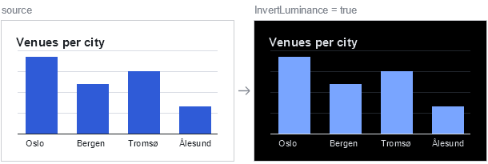

# Data Modelling & Querying with Relatude.DB

**A practical manual**

Relatude.DB is an open-source, C#-native object-oriented graph database with integrated full-text
(BM25) search, vector/semantic search, file storage, faceting and a built-in admin UI. It runs
in-process or server-hosted, and targets .NET 8+.

This manual covers the part of the engine you touch every day: how to shape your data, and how to
get it back out. It uses **one running example domain** — a venue-and-events platform — so every
concept builds on the last.

> **Version note.** Relatude.DB is pre-1.0 and the public API still moves. Everything in this manual
> is taken from the source at `github.com/Relatude/Relatude.DB` under `src/Relatude.DB.NodeStore/`
> and `src/Relatude.DB.Common/`. When something here disagrees with your build, the source wins.

---

## Table of contents

**Part I — Data modelling**

1. [The mental model](#1-the-mental-model)
2. [Your first node type — and why interfaces win](#2-your-first-node-type)
3. [Scalar properties and their attributes](#3-scalar-properties-and-their-attributes)
4. [Marker properties](#4-marker-properties)
5. [Geo coordinates](#5-geo-coordinates)
6. [Files](#6-files)
7. [Embedded data](#7-embedded-data)
8. [References — lightweight pointers](#8-references--lightweight-pointers)
9. [Relations — the graph edges](#9-relations--the-graph-edges) · [9.1 ordered relation lists](#91-relation-lists-are-ordered)
10. [Choosing between relation, reference and embedded](#10-choosing-between-relation-reference-and-embedded)
11. [The complete example model](#11-the-complete-example-model) · [11.1 with facet interfaces](#111-the-same-model-with-facet-interfaces)
12. [Registering the model & the admin UI](#12-registering-the-model--the-admin-ui) · [12.1 every relatude.db.json setting](#121-every-setting-in-relatudedbjson)

**Part II — Writing data**

13. [Create, insert, update, delete](#13-create-insert-update-delete)
14. [Relating nodes](#14-relating-nodes)
15. [Transactions](#15-transactions)
16. [Older versions of a node](#16-older-versions-of-a-node) · [16.1 reverting the database](#161-reverting-the-database-to-an-earlier-point)
17. [Uploading files](#17-uploading-files)
18. [URLs and the URL manager](#18-urls-and-the-url-manager) · [18.1 asset URLs](#181-asset-urls-files-variants-and-deeplinks) · [18.2 links inside HTML](#182-links-inside-html-and-markdown)

**Part III — Querying**

19. [Query anatomy](#19-query-anatomy)
20. [Filtering with Where](#20-filtering-with-where)
21. [Text and semantic search](#21-text-and-semantic-search)
22. [Geo queries](#22-geo-queries)
23. [Relation filters](#23-relation-filters)
24. [Eager loading: Include and Preload](#24-eager-loading-include-and-preload)
25. [Graph traversal and shortest path](#25-graph-traversal-and-shortest-path)
26. [Sorting, paging and result sets](#26-sorting-paging-and-result-sets)
27. [Aggregates](#27-aggregates)
28. [Faceted search](#28-faceted-search)
29. [Cultures, visibility and scoped stores](#29-cultures-visibility-and-scoped-stores)
30. [Pitfalls and gotchas](#30-pitfalls-and-gotchas)

**Part IV — Tooling**

31. [The command line tool](#31-the-command-line-tool)

---
---

# Part I — Data modelling

## 1. The mental model

Everything in Relatude.DB is a **node**. A node has:

| Ingredient | What it is |
|---|---|
| `Guid Id` | The public identity. The engine also keeps an internal `int __Id` for fast indexing. |
| `NodeMeta Meta` | System-managed metadata: timestamps, culture, revision, ACL, display name, address. |
| **Scalar properties** | `string`, `int`, `decimal`, `DateTime`, `bool`, `Guid`, `GeoCoordinate`, `FileValue`, arrays… |
| **Embedded data** | Owned sub-objects stored inline in the parent — `Embedded<T>`, `EmbeddedMap<TKey,TValue>`. |
| **References** | A stored `Guid` (or `Guid[]`) pointing at other nodes — one-directional, no reverse index. |
| **Relations** | Real graph edges declared as their own classes — bidirectional, indexed, traversable. |

There is no separate "schema language". Your C# types *are* the schema. Point the engine at a
namespace and it builds the datamodel from your interfaces and classes.

### Interfaces are the model

A node type can be an **interface, a class, a record or a struct** — the engine supports all four.
No attribute is needed to opt in: every type in a namespace you point the engine at becomes a node
type unless it is marked `[Exclude]`. `[Node]` only *tunes* one (see
[stable type ids](#optional-stable-type-ids) below), which is why almost no type in this manual
carries it. Interfaces are the recommended default, and the rest of this manual models almost
everything with interfaces alone.

The headline: **you do not need a class at all.** An interface on its own is a complete node type.
`store.Create<IVenue>()` hands you a generated proxy that implements it, tracks your changes and
lazily loads relations. No concrete class is ever written, and none is needed.

The reason to prefer interfaces goes beyond saving a file: **C# allows a type to implement many
interfaces but inherit only one class.** Because Relatude.DB treats every interface a node type
implements as a *parent node type*, interface-based modelling gives you real multiple inheritance
in the datamodel — shared, queryable facets that cut across your hierarchy. Classes cannot do this.

[§2](#2-your-first-node-type) works through it.

---

## 2. Your first node type

The three namespaces you will import in every model file:

```csharp
using Relatude.DB.Common;       // FileValue, GeoCoordinate, NodeKey
using Relatude.DB.Datamodels;   // NodeMeta, RevisionType
using Relatude.DB.Nodes;        // attributes, relation bases, Reference, References, EmbeddedMap
```

Here is `IOrganizer` — a company that runs events. **This interface is the entire node type. There
is no class, and none is needed:**

```csharp
namespace VenueApp.Models;

public interface IOrganizer {
    Guid Id { get; set; }

    [DisplayNameProperty]
    [StringProperty(Indexed = true, MaxLength = 200, IndexedByWords = true)]
    string Name { get; set; }

    [StringProperty(StringType = StringValueType.Email, UniqueValues = true)]
    string ContactEmail { get; set; }

    [StringProperty(Indexed = true, UniqueValues = true, RegularExpression = @"^[a-z0-9-]+$")]
    string Slug { get; set; }

    [CreatedUtcProperty]
    DateTime CreatedUtc { get; set; }

    NodeMeta Meta { get; }          // read-only on the interface
}
```

That is it. You now have a full node type:

```csharp
var org = db.Create<IOrganizer>();      // a generated proxy implementing IOrganizer
org.Name = "Nordic Live AS";
org.ContactEmail = "hello@nordiclive.no";
db.Insert(org);

var again = db.Get<IOrganizer>(org.Id);
var all   = db.Query<IOrganizer>().Where(o => o.Name.StartsWith("Nordic")).Execute();
```

Three rules for interface node types:

1. **`Meta` is getter-only.** So are relation, reference and embedded properties. The proxy owns
   their initialisation — you never assign them. Scalar properties are `{ get; set; }`.
2. **Leave `Id` as `Guid.Empty` on insert** and the store assigns one, or set it yourself first.
3. **Put your attributes on the interface.** Property *definitions* live on the type that first
   declares them, so an attribute on a class that merely implements an interface member is ignored.
   The interface is the single source of truth for the property model.

Add `[Exclude]` to any type or property the datamodel should skip.

### Why interfaces are the better default

| | Interface | Class |
|---|---|---|
| Multiple inheritance | **yes** — many interfaces per type | no — one base class |
| Instantiation | `db.Create<T>()` returns a proxy | `new T()` or `db.Create<T>()` |
| Change tracking | proxy tracks property writes | you manage state yourself |
| Lazy relation loading | handled by the proxy | handled by the property types |
| Default values | not needed — the proxy handles it | you must initialise every reference type |
| Parameterless ctor | n/a | **mandatory**, or the model builder throws |
| Query surface | identical | identical |

The practical effect: an interface model is shorter, has no initialisation boilerplate to forget,
and — the big one — composes.

### Multiple inheritance with interfaces

When the engine builds a node type it records **every interface the type implements as a parent
node type**. So interfaces are not just a declaration style; they are the inheritance mechanism.
And because a C# type may implement any number of interfaces, you get modelling shapes that a
single-base-class hierarchy simply cannot express.

Define small, focused facet interfaces:

```csharp
// A thing that sits somewhere on the map.
public interface ILocatable {
    [GeoCoordinateProperty(Indexed = true)]
    GeoCoordinate Location { get; set; }

    [StringProperty(Indexed = true, MaxLength = 2)]
    string CountryCode { get; set; }
}

// A thing with an identity, a name and a slug.
public interface INamedNode {
    Guid Id { get; set; }
    NodeMeta Meta { get; }

    [DisplayNameProperty]
    [StringProperty(Indexed = true, IndexedByWords = true, PrefixSearch = true)]
    string Title { get; set; }

    [AddressProperty]
    [StringProperty(Indexed = true, UniqueValues = true)]
    string Slug { get; set; }
}

// A thing with a rich-text body that should be searchable.
public interface IDescribed {
    [HtmlProperty(IndexedByWords = true, IndexedBySemantic = true)]
    string Description { get; set; }
}

// A thing that can be tagged.
public interface ITagged {
    [StringArrayProperty(Indexed = true)]
    string[] Tags { get; set; }
}
```

…then compose them freely, mixing and matching per type:

```csharp
public interface IVenue    : INamedNode, IDescribed, ILocatable, ITagged { /* venue-only    */ }
public interface IEvent    : INamedNode, IDescribed,              ITagged { /* event-only    */ }
public interface IAttendee : INamedNode,              ILocatable          { /* attendee-only */ }
```

Each facet's properties are declared exactly once, with their indexing and validation attached, and
every implementing type inherits them. Change `ILocatable.Location` to `Indexed = false` and both
venues and attendees follow. Add a fifth node type that should appear on the map and it is one
interface in the declaration — no property copying, no query to update.

A class-based model cannot express this. `Venue` can inherit one base class, so the moment you want
"locatable" *and* "described" *and* "tagged" you are copying properties between types and keeping
their attributes in sync by hand.

### Querying across the hierarchy

This is where multiple inheritance pays off at runtime. **`Query<T>()` matches `T` and every type
descending from it**, so you can query a facet interface directly and get heterogeneous results:

```csharp
// Every locatable node of any type within 5 km — venues and attendees together
var nearby = db.Query<ILocatable>()
               .Where(x => x.Location.IsWithin(oslo, 5_000))
               .Execute();

foreach (var x in nearby) {
    Console.WriteLine(x switch {
        IVenue v    => $"Venue: {v.Title}",
        IAttendee a => $"Attendee: {a.Title}",
        _           => "Something else"
    });
}

// One search box over everything that has a title
var hits = db.Query<INamedNode>()
             .WhereSearch("outdoor jazz", semanticRatio: 0.5)
             .Execute();

// One tag cloud over everything taggable
var tagCloud = db.Query<ITagged>().Facets().AddValueFacet(x => x.Tags).Execute();

// …narrowed back down to specific types when you want that
var venuesOnly = db.Query<ILocatable>()
                   .WhereTypes(new[] { typeof(IVenue) }, includeDescendants: true)
                   .Where(x => x.CountryCode == "NO")
                   .Execute();
```

A cross-cutting search page, a global "recently changed" feed, a map view that plots anything with
coordinates — each is one indexed query against a facet interface, rather than one query per
concrete type merged and re-sorted in memory.

> The full example model in [§11](#11-the-complete-example-model) declares every property directly
> on each type, so that each one reads as a self-contained unit. [§11.1](#111-the-same-model-with-facet-interfaces)
> shows the same model refactored onto facet interfaces — that is the shape to reach for in a real
> project.

### Two constraints to design around

The model builder is strict about ambiguity, and both rules bite exactly where you would expect:

1. **Two parent interfaces may not declare the same property name.** If `ILocatable` and `ITagged`
   both declared `CountryCode`, any type implementing both fails to build. Keep facets disjoint, or
   hoist the shared member into a base interface that both extend.
2. **Property overriding is not supported.** A property is defined once, on the type that first
   declares it. You cannot redeclare it further down to change its attributes.

Both are checked at model-build time, not at runtime, so you find out immediately.

### When you do want a class

Classes are fully supported and there are legitimate reasons to reach for one:

- You want to `new` nodes up yourself — in seed data, tests, or an import job — without a store.
- You want behaviour on the type: computed members, helper methods, `ToString()`.
- You are deserialising directly into the model type from an external feed.

You can also pair an interface with a class that implements it, which gives you the interface as
the queryable contract and the class as a concrete instantiable form. When you write a class, four
extra obligations apply:

```csharp
public class Organizer : IOrganizer {
    public Guid Id { get; set; }

    // Attributes live on IOrganizer — repeating them here has no effect.
    public string Name { get; set; } = string.Empty;
    public string ContactEmail { get; set; } = string.Empty;
    public string Slug { get; set; } = string.Empty;
    public DateTime CreatedUtc { get; set; }

    public NodeMeta Meta { get; set; } = NodeMeta.Empty;   // read-write on the class
}
```

1. **A parameterless constructor is mandatory.** The model builder throws without one.
2. **Initialise every reference-typed member.** `string.Empty`, `FileValue.Empty`,
   `NodeMeta.Empty`, `[]` for embedded maps, `new()` for relation and reference properties.
   Interfaces need none of this.
3. **`Meta` becomes get/set.** Still never build one — use `NodeMeta.Empty`.
4. **Attributes belong on the interface** when the class implements one.

Records and structs work too — a record needs the `record Foo() { … }` form to satisfy the
parameterless-constructor rule, and structs are supported but rarely worth it.

### Optional: stable type ids

When you do not supply an id, the engine derives one by hashing the type's **full name**. That is
convenient, but it means renaming a type or moving it to another namespace gives it a *new
identity* — and the engine sees a brand-new type with no data. Rename-proof your model by pinning
`[Node(Id = …)]` once, at the start of the project. The same applies to `[Relation(Id = …)]`.

```csharp
[Node(
    Id = "6a1d9f2e-0b41-4c8a-9d7b-3f2c5e8a1b40",
    TextIndex = BoolValue.True,        // include in the BM25 index
    SemanticIndex = BoolValue.False,   // skip the vector index
    TextIndexBoost = 1.5
)]
public interface IOrganizer { /* ... */ }
```

`BoolValue` is tri-state: `Default` (let the engine decide), `True`, `False`. `[Node]` also accepts
`MinNoInstances` / `MaxNoInstances` to constrain how many instances of the type may exist.

---

## 3. Scalar properties and their attributes

You can declare a plain property with no attribute at all and the engine infers a sensible
property model from the CLR type. You add an attribute when you want **indexing**, **validation**,
**faceting** or **search** behaviour.

The single most important flag is `Indexed`. **A property must be indexed to be filtered, sorted or
faceted efficiently.** Without it, the engine falls back to scanning.

### The attribute catalogue

| CLR type | Attribute |
|---|---|
| `string` | `[StringProperty]` |
| `string` (rich text) | `[HtmlProperty]` — a `[StringProperty]` pre-set to `StringType = HTML` |
| `int` / `enum` | `[IntegerProperty]` |
| `long` | `[LongProperty]` |
| `double` | `[DoubleProperty]` |
| `float` | `[FloatProperty]` |
| `decimal` | `[DecimalProperty]` |
| `bool` | `[BooleanProperty]` |
| `Guid` | `[GuidProperty]` |
| `DateTime` | `[DateTimeProperty]` |
| `DateTimeOffset` | `[DateTimeOffsetProperty]` |
| `TimeSpan` | `[TimeSpanProperty]` |
| `GeoCoordinate` | `[GeoCoordinateProperty]` |
| `byte[]` | `[ByteArrayProperty]` |
| `float[]` | `[FloatArrayProperty]` |
| `string[]` | `[StringArrayProperty]` |
| `Guid[]` | `[GuidArrayProperty]` |
| `TEnum[]` | `[EnumArrayProperty]` |
| `FileValue` | `[FileProperty]` |

All of them inherit shared options from `PropertyAttribute`:

```csharp
public abstract class PropertyAttribute : Attribute {
    public string? Id { get; set; }              // stable property id, rename-proof
    public string? ReadAccess { get; set; }      // ACL slot
    public string? WriteAccess { get; set; }
    public bool ExcludeFromTextIndex { get; set; }
    public int TextIndexBoost { get; set; }
    public bool DisplayName { get; set; }
}
```

### Strings

`[StringProperty]` is the richest of the set:

```csharp
[StringProperty(
    MinLength = 0,
    MaxLength = 4000,
    StringType = StringValueType.AnyString,  // AnyString | HTML | Url | Email | ...
    Indexed = true,                          // value index: equality, range, sort
    IndexedByWords = true,                   // BM25 full-text index
    IndexedBySemantic = true,                // vector / semantic index
    PrefixSearch = true,                     // "starts with" index
    InfixSearch = false,                     // "contains" index (expensive — opt in deliberately)
    PreloadWordIndex = false,
    MinWordLength = 3,
    MaxWordLength = 30,
    LegalValues = new[] { "draft", "published", "cancelled" },
    RegularExpression = @"^[a-z0-9-]+$",
    UniqueValues = true,
    IgnoreDuplicateEmptyValues = true,       // allow many empty values under UniqueValues
    NotFacet = false,                        // exclude from faceting even when indexed
    DefaultValue = ""
)]
public string Slug { get; set; } = string.Empty;
```

Use `[HtmlProperty]` for rich text so the HTML is stripped before word indexing:

```csharp
[HtmlProperty(IndexedByWords = true, IndexedBySemantic = true)]
public string Description { get; set; } = string.Empty;
```

### Numbers

Numeric attributes share `MinValue` / `MaxValue` / `DefaultValue` / `Indexed` / `NotFacet`, plus
range-faceting controls:

```csharp
[IntegerProperty(MinValue = 0, MaxValue = 100000, Indexed = true)]
public int Capacity { get; set; }

[DoubleProperty(Indexed = true, FacetRangePowerBase = 2.0, FacetRangeCount = 8)]
public double AverageRating { get; set; }
```

`FacetRangePowerBase` and `FacetRangeCount` control how the engine auto-buckets a numeric property
when you ask for a range facet.

**`decimal`, `DateTime`, `DateTimeOffset`, `TimeSpan` and `Guid` are not legal C# attribute
parameter types**, so their bounds and defaults are passed as strings in a fixed format:

```csharp
// decimal — invariant culture
[DecimalProperty(MinValue = "0", MaxValue = "100000", DefaultValue = "0", Indexed = true)]
public decimal Price { get; set; }

// DateTime / DateTimeOffset — round-trip ("O") format
[DateTimeProperty(MinValue = "2000-01-01T00:00:00.0000000Z", Indexed = true)]
public DateTime StartsUtc { get; set; }

// TimeSpan — constant ("c") format
[TimeSpanProperty(MaxValue = "1.00:00:00", Indexed = true)]
public TimeSpan Duration { get; set; }

// Guid — plain string form
[GuidProperty(Indexed = true, UniqueValues = true)]
public Guid ExternalRef { get; set; }
```

### Enums

Declare the property as your enum type. The engine stores it as an integer and auto-populates the
enum metadata (`FullEnumTypeName`, `LegalValues`, `LegalValueNames`) so the admin UI and facets
show names rather than numbers:

```csharp
public enum EventStatus { Draft = 0, Published = 1, SoldOut = 2, Cancelled = 3 }

[IntegerProperty(Indexed = true)]
public EventStatus Status { get; set; }
```

Arrays of enums use `[EnumArrayProperty]`, which carries the same auto-populated metadata:

```csharp
[EnumArrayProperty(Indexed = true)]
public AccessibilityFeature[] Accessibility { get; set; } = [];
```

### Validation happens on write

`LegalValues`, `RegularExpression`, `MinValue`/`MaxValue`, `MinLength`/`MaxLength`, `UniqueValues`
and `MinNoInstances`/`MaxNoInstances` are all enforced by the engine at write time. A violating
transaction fails rather than silently storing bad data.

---

## 4. Marker properties

Six attributes tag a property as playing a special structural role. **At most one property per type
per role.**

| Attribute | Meaning |
|---|---|
| `[DisplayNameProperty]` | The human-readable name. Surfaces in the admin UI, search highlighting and `Meta.DisplayName`. |
| `[AddressProperty]` | The URL slug — one segment of the address, not the whole path. Surfaces as `Meta.Address` and feeds the URL manager ([§18](#18-urls-and-the-url-manager)). |
| `[PublicIdProperty]` | The external id used in URLs and APIs. Defaults to `Id` (Guid). |
| `[InternalIdProperty]` | The internal int id. Defaults to `__Id`. |
| `[CreatedUtcProperty]` | Stamped with the creation time. |
| `[ChangedUtcProperty]` | Stamped with the last-change time. |

```csharp
[DisplayNameProperty]
[StringProperty(Indexed = true, IndexedByWords = true)]
public string Title { get; set; } = string.Empty;

[AddressProperty]
[StringProperty(Indexed = true, UniqueValues = true)]   // UniqueValues only when URLs are flat, see §18
public string Address { get; set; } = string.Empty;

[CreatedUtcProperty] public DateTime CreatedUtc { get; set; }
[ChangedUtcProperty] public DateTime ChangedUtc { get; set; }
```

### What lives in `NodeMeta`

Every node carries system metadata. Read it; never write it.

| Field | Meaning |
|---|---|
| `Id`, `InternalId` | Public Guid and internal int id. |
| `NodeTypeId` | The type id from `[Node(Id = …)]`. |
| `CreatedUtc`, `ChangedUtc` | Timestamps. |
| `DisplayName`, `Address` | Sourced from the marker properties above. |
| `CultureId` | Culture of this revision. |
| `RevisionId`, `RevisionType` | Revision tracking — `Draft`, `Published`, `Archived`, … |
| `CollectionId` | Logical grouping. |
| `ReadAccess`, `EditAccess`, `EditViewAccess`, `PublishAccess` | Guid-based ACL slots. |
| `CreatedBy`, `ChangedBy` | User Guids. |
| `ReleaseUtc`, `ExpireUtc` | Scheduled publishing. |
| `Deleted` | Soft-delete flag. |

---

## 5. Geo coordinates

`GeoCoordinate` (in `Relatude.DB.Common`) is a first-class, indexable value type for WGS84
latitude/longitude. It is a `readonly struct`, so it costs nothing to pass around.

```csharp
using Relatude.DB.Common;

public interface IVenue {
    // ...
    [GeoCoordinateProperty(Indexed = true)]     // Indexed = true enables spatial query acceleration
    GeoCoordinate Location { get; set; }
}
```

### Constructing and reading

```csharp
var oslo    = new GeoCoordinate(59.9139, 10.7522);
var bergen  = new GeoCoordinate(60.3913, 5.3221);

double lat  = oslo.Latitude;     // 59.9139…  (NaN when empty)
double lon  = oslo.Longitude;    // 10.7522…  (NaN when empty)

Console.WriteLine(oslo);         // "59.9139, 10.7522"

GeoCoordinate.TryParse("59.9139, 10.7522", out var parsed);   // round-trips
```

### The empty value

`GeoCoordinate.Empty` is `default(GeoCoordinate)` and means **"no location"**:

```csharp
var unknown = GeoCoordinate.Empty;
unknown.IsEmpty;                      // true
unknown.Latitude;                     // double.NaN
unknown.DistanceTo(oslo);             // double.PositiveInfinity
unknown.IsWithin(oslo, 100_000);      // false — never matches
```

Empty coordinates are excluded from spatial indexes entirely. This is exactly what you want: a
venue whose location has not been entered yet should never show up in a "within 5 km" search.

### Distance and radius tests

```csharp
double meters = oslo.DistanceTo(bergen);        // great-circle distance (haversine), in metres
bool   near   = oslo.IsWithin(bergen, 500_000); // true — within 500 km
```

`IsWithin(center, meters)` is the important one: **the query compiler recognises it inside a query
lambda and accelerates it with the spatial index.** See [§22 Geo queries](#22-geo-queries).

### How it is stored (and what that implies)

Coordinates snap to a ~1 cm grid (31 bits per axis) on construction and are stored as a 62-bit
Morton / Z-order code. Three consequences worth knowing:

- **Equality, hashing and ordering coincide exactly**, and every value round-trips losslessly
  through `StorageValue` / `FromStorageValue`.
- **Sort order follows the Z-order curve**, which keeps ranges spatially coherent for index scans
  but is *meaningless as a user-facing sort*. To sort by proximity, order by `DistanceTo` after
  materialising the page — do not `OrderBy(v => v.Location)`.
- **Radius searches over-scan slightly.** The index cover is built from square Z-order cells; a
  circle is not square. The engine refines candidates with the exact haversine distance, so results
  are correct — but a very large radius touches more of the index than a small one.

### JSON shape

`GeoCoordinate` serialises as `{"latitude": 59.91, "longitude": 10.75}`, and `Empty` serialises as
`null` so it survives a round trip. On read it also accepts `lat` / `lon` / `lng` aliases and a
`"latitude, longitude"` string.

---

## 6. Files

`FileValue` (in `Relatude.DB.Common`) is a slot into the file storage subsystem — local disk, Azure
blob, and so on, configured separately in the admin UI. The property holds the reference; the bytes
live in storage.

```csharp
[FileProperty]
public FileValue Photo { get; set; } = FileValue.Empty;

// pin a property to a specific storage provider:
[FileProperty(FileStorageProviderId = "b1c2d3e4-...")]
public FileValue Brochure { get; set; } = FileValue.Empty;
```

Uploading and serving bytes is covered in [§17](#17-uploading-files), and the URLs they are served on in [§18](#18-urls-and-the-url-manager).

---

## 7. Embedded data

Embedded objects are **owned sub-trees**. They are stored inline in the parent node, they have no
independent identity in the graph, and they live and die with the parent. Reach for them when a
value only makes sense in the context of its parent: opening hours on a venue, line items on an
order, translations on a label.

Two flavours:

### `Embedded<T>` — a collection keyed by the embedded object's own `Guid Id`

```csharp
[EmbeddedProperty(IncludeTypes = IncludeTypeOptions.ThisTypeAndDescending)]
public Embedded<PriceTier> PriceTiers { get; set; } = [];
```

`IncludeTypeOptions` controls which subtypes are allowed in the slot.

### `EmbeddedMap<TKey, TValue>` — a collection keyed by a property of the value

```csharp
public class OpeningHours {
    public Guid Id { get; set; }
    public string DayCode { get; set; } = string.Empty;   // "mon", "tue", …
    public TimeSpan Opens { get; set; }
    public TimeSpan Closes { get; set; }
}

public interface IVenue {
    // ...
    [EmbeddedMapProperty(
        KeyProperty = nameof(OpeningHours.DayCode),
        KeyType = KeyPropertyType.NodeProperty)]      // or NodeGuidId / NodeIntegerId
    EmbeddedMap<string, OpeningHours> Hours { get; }
}
```

Naming a `KeyProperty` is enough — it takes precedence over `KeyType`, so the second line above is
documentation rather than necessity. `KeyType` is what you set when there is *no* key property:
`NodeGuidId` keys by the embedded value's `Guid Id` (which is exactly what `Embedded<T>` is
shorthand for) and `NodeIntegerId` by its int id. With no attribute at all the key type is inferred
from `TKey`: `Guid` → `NodeGuidId`, `int` → `NodeIntegerId`, anything else is an error telling you
to name a `KeyProperty`.

The key property has to live on the closest common base of the allowed inner types, and its CLR
type must equal `TKey` — both are checked at model-build time.

### Working with an embedded map

```csharp
var venue = db.Create<IVenue>();

var monday = new OpeningHours { DayCode = "mon", Opens = new(9, 0, 0), Closes = new(23, 0, 0) };
venue.Hours.Add(monday);

db.Insert(venue);

// only *after* the parent is persisted can you read by key:
var stored = db.Get<IVenue>(venue.Id);
var mon    = stored.Hours["mon"];
int days   = stored.Hours.Count;                  // a property, not a method
bool open  = stored.Hours.Contains("mon");        // by key, not by value

foreach (var h in stored.Hours) {                 // EmbeddedMap<TKey,TValue> is IEnumerable<TValue>
    Console.WriteLine($"{h.DayCode}: {h.Opens}–{h.Closes}");
}

foreach (var (day, h) in stored.Hours.KeysAndValues()) { … }   // when you want the keys too
```

> **Gotcha.** Before the parent is inserted, only `Add`, `Clear`, `Count` and enumeration are safe.
> Anything keyed — the indexer, `Contains`, `KeysAndValues()` — throws
> `InvalidOperationException` until the parent has been persisted, because the keys are evaluated by
> the store.

---

## 8. References — lightweight pointers

A **reference** is a `Guid` (or an ordered `Guid[]`) stored directly on the node. It is a one-way
pointer: cheap to store, cheap to set, and it does not create a reverse index.

| Type | Stores | Use for |
|---|---|---|
| `Reference<T>` | one `Guid` | "the cover image of this event" |
| `References<T>` | ordered `Guid[]`, duplicates preserved | "the sponsors of this event, in billing order" |

```csharp
public interface IEvent {
    // ...
    [ReferenceProperty(Indexed = true)]     // Indexed = true is required to filter / facet on it
    Reference<IMediaAsset> Cover { get; }

    [ReferencesProperty(Indexed = true)]
    References<IOrganizer> Sponsors { get; }
}
```

On a concrete class, initialise them:

```csharp
public Reference<IMediaAsset>  Cover    { get; set; } = new();
public References<IOrganizer>  Sponsors { get; set; } = new();
```

### Reading and writing a `Reference<T>`

```csharp
var ev = db.Get<IEvent>(eventId);

ev.Cover.IsSet();                       // is a target set at all?
ev.Cover.Id;                            // the raw Guid (Guid.Empty when unset)

if (ev.Cover.TryGet(out var asset)) {   // lazily loads the target
    Console.WriteLine(asset.FileName);
}

var img = ev.Cover.Get();               // throws when unset

ev.Cover.Set(someAssetId);              // by id
ev.Cover.Set(someAsset, db);            // by instance
ev.Cover.Clear();
db.Update(ev);                          // references are node data — persist with a normal Update
```

### Reading and writing a `References<T>`

```csharp
ev.Sponsors.Ids;                        // Guid[] in stored order
ev.Sponsors.Count();
ev.Sponsors.Contains(organizerId);

ev.Sponsors.Add(organizerId);
ev.Sponsors.Add(organizerNode, db);
ev.Sponsors.Remove(organizerId);        // removes every occurrence
ev.Sponsors.Clear();
ev.Sponsors.Ids = new[] { a, b, c };    // replace wholesale, order preserved
db.Update(ev);

foreach (var sponsor in ev.Sponsors.Get()) {  // lazily loads every live target, in order
    Console.WriteLine(sponsor.Name);
}
```

> **The enumeration trap.** Both `Reference<T>` and `References<T>` implement `IEnumerable<T>`, but
> **`foreach` only yields *preloaded* data.** If you did not `.Preload(...)` in the query, the
> `foreach` silently yields nothing. Use `.Get()` / `.TryGet(out …)` for lazy loading, and
> `foreach` only after a `Preload`. This is a deliberate design: it makes the N+1 query cost
> impossible to incur by accident.

Stale targets — deleted nodes, or nodes of the wrong type — are **skipped** by `References<T>.Get()`
rather than throwing. With many references per value, stale entries are routine and the engine
treats them as such.

---

## 9. Relations — the graph edges

A **relation** is a real, bidirectional, indexed edge. Relating A to B automatically relates B back
to A. Relations are what make this a graph database: they are traversable, filterable and
countable without loading either side.

**Relations are not foreign keys.** You never store `VenueId` on an event. You declare a relation
class, and expose one nested property class per side.

### The five shapes

```csharp
// 1. Symmetric 1:1 — "spouse". Both sides are the same property.
public class PairedWith : OneOne<IVenue> {
    public class Pair : One { }
}

// 2. Directional 1:1 — "husband ↔ wife".
public class PrimaryContact : OneToOne<IOrganizer, IAttendee> {
    public class Organizer : OneFrom { }
    public class Contact   : OneTo { }
}

// 3. Directional 1:N — "parent ↔ children". The workhorse.
public class EventsAtVenue : OneToMany<IVenue, IEvent> {
    public class Venue  : One { }     // goes on IEvent   — the "one" side
    public class Events : Many { }    // goes on IVenue   — the "many" side
}

// 4. Symmetric N:N — "friends".
public class Friends : ManyMany<IAttendee> {
    public class Peers : Many { }
}

// 5. Directional N:N — "teachers ↔ students".
public class Attendance : ManyToMany<IEvent, IAttendee> {
    public class Events    : ManyFrom { }   // goes on IAttendee
    public class Attendees : ManyTo { }     // goes on IEvent
}
```

| Base class | Symmetry | Cardinality | Nested classes available |
|---|---|---|---|
| `OneOne<T>` | symmetric | 1↔1, same type | `One` |
| `OneToOne<TFrom, TTo>` | directional | 1↔1 | `OneFrom`, `OneTo` |
| `OneToMany<TOne, TMany>` | directional | 1↔N | `One`, `Many` |
| `ManyMany<T>` | symmetric | N↔N, same type | `Many` |
| `ManyToMany<TFrom, TTo>` | directional | N↔N | `ManyFrom`, `ManyTo` |

There is no "zero-or-one" and no asymmetric many-to-one. Model the asymmetric case as
`OneToMany` in the appropriate direction. If your relationship genuinely does not fit — for
instance because the edge itself carries data like a ticket price or a role — **promote the edge to
a node type** with two relations hanging off it.

### Using them on node types

Each nested class becomes a property type. Give the property whatever name reads best:

```csharp
public interface IVenue {
    // ...
    EventsAtVenue.Events Events { get; }          // many events at this venue
}

public interface IEvent {
    // ...
    EventsAtVenue.Venue      Venue     { get; }   // the one venue of this event
    Attendance.Attendees     Attendees { get; }   // many attendees
}

public interface IAttendee {
    // ...
    Attendance.Events Attending { get; }
    Friends.Peers     Friends   { get; }
}
```

On concrete classes, initialise with `new()`:

```csharp
public EventsAtVenue.Events Events { get; set; } = new();
```

You may omit a side you do not need. Only declare both when you want navigation in both directions.

### The "one" side API

A `One` / `OneFrom` / `OneTo` property is an `OneProperty<T>`:

```csharp
var ev = db.Get<IEvent>(id);

ev.Venue.IsSet();                        // is there a related node?
ev.Venue.Count();                        // 0 or 1
var venue = ev.Venue.Get();              // throws when unset
if (ev.Venue.TryGet(out var v)) { … }    // safe probe
ev.Venue.Contains(someVenueId);
```

### The "many" side API

A `Many` / `ManyFrom` / `ManyTo` property is a `ManyProperty<T>`:

```csharp
var venue = db.Get<IVenue>(id);

int n = venue.Events.Count();            // counted from the index — does not load the nodes
bool has = venue.Events.Contains(evId);

foreach (var e in venue.Events) { … }    // enumerates; loads lazily if not preloaded
var all = venue.Events.Get();            // IEnumerable<IEvent>

// …or keep composing as a real query, which is what you want for anything non-trivial:
var upcoming = venue.Events
                    .Query()
                    .Where(e => e.StartsUtc > DateTime.UtcNow)
                    .OrderBy(e => e.StartsUtc)
                    .Page(0, 20)
                    .Execute();
```

`ManyProperty<T>.Query()` returns a full `IQueryOfNodes` rooted at that relation, so everything in
Part III applies to it.

> Unlike `Reference<T>`, **`foreach` over a `Many` side does load lazily** when nothing was
> preloaded. It is still worth using `.Include(...)` when you are iterating many parents — see
> [§24](#24-eager-loading-include-and-preload).

### 9.1 Relation lists are ordered

A `Many` side is a **list, not a set**. Each node keeps its related items in a fixed order, and that
order is stored, durable and reorderable. This is a real modelling feature: use it for hand-curated
sequences — a programme running order, a menu, an image gallery, a set of related products — instead
of inventing a `SortIndex` property and sorting on it in every query.

Four consequences to design around:

- **`AddRelation` appends to the bottom.** The most recently related item is last.
- **Enumeration follows the stored order.** `foreach`, `Get()` and preloaded includes all yield it,
  so a curated sequence survives a round trip untouched.
- **Duplicates are rejected.** Relating a pair that is already related **throws**, as does
  unrelating a pair that is not related. Order plus no duplicates is exactly list semantics over a
  set of distinct targets.
- **Each side is ordered independently.** In a many-to-many relation, the order of targets on a
  source and the order of sources on a target are two separate orderings; reordering one says
  nothing about the other.

A `One` / `OneFrom` / `OneTo` side holds at most one item, so ordering is a `Many`-side concept only.

#### The `MoveRelation…` family

Six method families reorder a list. Every one exists on `NodeStore` — returning `TransactionResult`
and taking `flushToDisk: bool = false` — and on `Transaction`, where it returns the `Transaction` so
calls chain.

```csharp
// offset: negative moves toward the top, positive toward the bottom
db.MoveRelation<IVenue>(venue, v => v.Events, ev, offset: -1);

db.MoveRelationToTop<IVenue>(venue, v => v.Events, headliner);
db.MoveRelationToBottom<IVenue>(venue, v => v.Events, lateAddition);

// anchor is another item already in the same list
db.MoveRelationBefore<IVenue>(venue, v => v.Events, ev, anchor: other);
db.MoveRelationAfter<IVenue>(venue, v => v.Events, ev, anchor: other);

// replace the whole order in one call
db.SetRelationOrder<IVenue>(venue, v => v.Events, orderedEvents);
```

Chained inside a transaction — relate and position in one commit:

```csharp
var t = db.CreateTransaction();
t.AddRelation<IVenue>(venue, v => v.Events, ev)
 .MoveRelationToTop<IVenue>(venue, v => v.Events, ev)
 .Execute();
```

#### Semantics

- **Multi-item moves behave like a list UI.** Pass a collection instead of a single item and the
  selection keeps its internal order and compacts against the ends of the list — the behaviour you
  want behind a multi-select drag handle.
- **Positions are clamped.** Moving past the top or bottom never throws.
- **`SetRelationOrder` reorders; it does not add or remove.** The ids you supply must be *exactly*
  the currently related ids.
- **Never reorder by un-relating and re-relating.** Beyond being two writes instead of one, a
  re-`AddRelation` lands at the bottom, and re-relating an already-related pair throws.

#### Overload shapes

Each family takes a single item or an `IEnumerable` of items, in three addressing styles:

```csharp
MoveRelationToTop<T>(T fromNode,  Expression<Func<T, object?>> expression, object item)
MoveRelationToTop<T>(Guid fromId, Expression<Func<T, object?>> expression, Guid item)
MoveRelationToTop   (Guid fromId, Guid propertyId,                         Guid item)
```

`MoveRelation` adds `int offset`; `MoveRelationBefore` / `MoveRelationAfter` add an `anchor` of the
same shape as `item`; `SetRelationOrder` takes only `itemsInOrder`. On `Transaction` the same
families also accept `int` internal ids. **Prefer the expression form** — readable and type-checked.

For raw relation-id access there is
`TransactionRelation.Move(relationId, owner, items, offset, reorderSourcesOfTarget = false)`, where
`reorderSourcesOfTarget: true` reorders a *target's* list of sources rather than the owner's list of
targets. Only meaningful for many-to-many, and rarely what you want from application code.

### Relation options

```csharp
[Relation(
    Id = "9f4e2c11-77a3-4d5e-8b21-0c6f9a3e7d54",  // stable id, survives renames
    DisallowCircularReferences = true              // enforce acyclicity on self-referential relations
)]
public class VenueTree : OneToMany<IVenue, IVenue> {
    public class Parent   : One { }
    public class Children : Many { }
}
```

`[Relation]` also accepts `SourceTypes` / `TargetTypes` as full type-name strings, but the generic
parameters already carry that information — you rarely need them.

Relation properties can also feed the parent's text index, which is how you make a venue findable
by the names of the events held there:

```csharp
[RelationProperty(
    TextIndexRelatedDisplayName = true,
    TextIndexRelatedContent = false,
    TextIndexRecursiveLevelLimit = 1,
    Facet = true                          // opt in to faceting on this relation
)]
public EventsAtVenue.Events Events { get; }
```

---

## 10. Choosing between relation, reference and embedded

This is the decision you will make most often. The short version:

| | **Embedded** | **Reference** | **Relation** |
|---|---|---|---|
| Identity | none — owned by parent | target is an independent node | both sides are independent nodes |
| Direction | n/a | one-way | bidirectional, automatic |
| Reverse lookup | n/a | no | yes, indexed |
| Traversable (`Traverse`, `ShortestPath`) | no | no | yes |
| Filter by target | no | yes, with `Indexed = true` | yes, `WhereRelates` |
| Order preserved | yes | `References<T>`: yes | **yes, per side** — and reorderable, see [§9.1](#91-relation-lists-are-ordered) |
| Duplicates | yes | `References<T>`: yes | no — relating an existing pair throws |
| Cost to change | rewrites parent node | rewrites parent node | index update, no node rewrite |
| Lifecycle | dies with parent | independent | independent |

**Decision guide**

- The child has no meaning outside the parent, and you never query it independently → **embedded**.
- You need the **same target more than once**, and you never need the reverse lookup →
  **`References<T>`**. Note that ordering by itself is *not* a reason to pick this: relation lists
  are ordered too, and come with reorder operations that references do not have.
- You point at one thing, cheaply, and never ask "what points at me?" → **`Reference<T>`**.
- You need reverse navigation, traversal, relation filters, relation facets, a curated order you can
  rearrange, or referential bookkeeping → **relation**. When in doubt, this is the right default.

Applied to the running example:

- `Venue.Hours` → embedded. Opening hours are meaningless without their venue.
- `Event.Cover` → `Reference<IMediaAsset>`. One-way pointer; nobody asks "which events use this
  image?" from the image side.
- `Event.Sponsors` → `References<IOrganizer>`. The same organizer can appear twice at different
  billing tiers, and we never ask an organizer for its sponsored events from that property. Order
  matters here, but that alone would not decide it — a relation would give ordering too, plus
  reorder operations; **duplicates are what rule a relation out**.
- `Event ↔ Venue`, `Event ↔ Attendee` → relations. Both directions are navigated constantly, and a
  venue's event list is curated by hand — which the relation's stored order handles for free.

---

## 11. The complete example model

Here is the whole running domain in one place. Everything in Part II and Part III queries this
model.

```csharp
using Relatude.DB.Common;
using Relatude.DB.Datamodels;
using Relatude.DB.Nodes;

namespace VenueApp.Models;

public enum EventStatus { Draft = 0, Published = 1, SoldOut = 2, Cancelled = 3 }
public enum VenueKind   { Indoor = 0, Outdoor = 1, Hybrid = 2 }

// ────────────────────────────────────────────────────────────────────────────
//  Node types
// ────────────────────────────────────────────────────────────────────────────

public interface IOrganizer {
    Guid Id { get; set; }
    NodeMeta Meta { get; }

    [DisplayNameProperty]
    [StringProperty(Indexed = true, MaxLength = 200, IndexedByWords = true)]
    string Name { get; set; }

    [StringProperty(StringType = StringValueType.Email, UniqueValues = true)]
    string ContactEmail { get; set; }

    [AddressProperty]
    [StringProperty(Indexed = true, UniqueValues = true, RegularExpression = @"^[a-z0-9-]+$")]
    string Slug { get; set; }

    [CreatedUtcProperty] DateTime CreatedUtc { get; set; }

    OrganizerEvents.Events Events { get; }
}

public interface IVenue {
    Guid Id { get; set; }
    NodeMeta Meta { get; }

    [DisplayNameProperty]
    [StringProperty(Indexed = true, IndexedByWords = true, PrefixSearch = true)]
    string Name { get; set; }

    [AddressProperty]
    [StringProperty(Indexed = true, UniqueValues = true)]
    string Slug { get; set; }

    [HtmlProperty(IndexedByWords = true, IndexedBySemantic = true)]
    string Description { get; set; }

    [GeoCoordinateProperty(Indexed = true)]
    GeoCoordinate Location { get; set; }

    [StringProperty(Indexed = true, MaxLength = 2)]
    string CountryCode { get; set; }

    [IntegerProperty(Indexed = true, MinValue = 0)]
    int Capacity { get; set; }

    [IntegerProperty(Indexed = true)]
    VenueKind Kind { get; set; }

    [BooleanProperty(Indexed = true)]
    bool IsAccessible { get; set; }

    [FileProperty]
    FileValue Photo { get; set; }

    [EmbeddedMapProperty(KeyProperty = nameof(OpeningHours.DayCode))]
    EmbeddedMap<string, OpeningHours> Hours { get; }

    VenueTree.Parent        Parent { get; }   // e.g. a hall inside a complex
    VenueTree.Children      Halls  { get; }
    EventsAtVenue.Events    Events { get; }
}

public interface IEvent {
    Guid Id { get; set; }
    NodeMeta Meta { get; }

    [DisplayNameProperty]
    [StringProperty(Indexed = true, IndexedByWords = true, IndexedBySemantic = true, PrefixSearch = true)]
    string Title { get; set; }

    [HtmlProperty(IndexedByWords = true, IndexedBySemantic = true)]
    string Description { get; set; }

    [DateTimeProperty(Indexed = true)]
    DateTime StartsUtc { get; set; }

    [TimeSpanProperty(Indexed = true, MaxValue = "1.00:00:00")]
    TimeSpan Duration { get; set; }

    [DecimalProperty(Indexed = true, MinValue = "0", DefaultValue = "0",
                     FacetRangePowerBase = 2.0, FacetRangeCount = 6)]
    decimal Price { get; set; }

    [IntegerProperty(Indexed = true)]
    EventStatus Status { get; set; }

    [StringArrayProperty(Indexed = true)]
    string[] Tags { get; set; }

    [ReferenceProperty(Indexed = true)]
    Reference<IMediaAsset> Cover { get; }

    [ReferencesProperty(Indexed = true)]
    References<IOrganizer> Sponsors { get; }

    EventsAtVenue.Venue    Venue     { get; }
    OrganizerEvents.Host   Host      { get; }
    Attendance.Attendees   Attendees { get; }
}

public interface IAttendee {
    Guid Id { get; set; }
    NodeMeta Meta { get; }

    [DisplayNameProperty]
    [StringProperty(Indexed = true, IndexedByWords = true)]
    string FullName { get; set; }

    [StringProperty(StringType = StringValueType.Email, Indexed = true, UniqueValues = true)]
    string Email { get; set; }

    [GeoCoordinateProperty(Indexed = true)]
    GeoCoordinate HomeLocation { get; set; }

    Attendance.Events Attending { get; }
    Friends.Peers     Friends   { get; }
}

public interface IMediaAsset {
    Guid Id { get; set; }
    NodeMeta Meta { get; }

    [DisplayNameProperty]
    [StringProperty(Indexed = true)]
    string FileName { get; set; }

    [FileProperty]
    FileValue File { get; set; }
}

// ────────────────────────────────────────────────────────────────────────────
//  Embedded types
// ────────────────────────────────────────────────────────────────────────────

public class OpeningHours {
    public Guid Id { get; set; }
    public string DayCode { get; set; } = string.Empty;   // "mon" … "sun"
    public TimeSpan Opens { get; set; }
    public TimeSpan Closes { get; set; }
}

// ────────────────────────────────────────────────────────────────────────────
//  Relations
// ────────────────────────────────────────────────────────────────────────────

public class EventsAtVenue : OneToMany<IVenue, IEvent> {
    public class Venue  : One { }
    public class Events : Many { }
}

public class OrganizerEvents : OneToMany<IOrganizer, IEvent> {
    public class Host   : One { }
    public class Events : Many { }
}

public class Attendance : ManyToMany<IEvent, IAttendee> {
    public class Attendees : ManyTo { }
    public class Events    : ManyFrom { }
}

public class Friends : ManyMany<IAttendee> {
    public class Peers : Many { }
}

[Relation(DisallowCircularReferences = true)]
public class VenueTree : OneToMany<IVenue, IVenue> {
    public class Parent   : One { }
    public class Children : Many { }
}
```

### 11.1 The same model with facet interfaces

The model above declares everything directly on each type, which keeps each one readable in
isolation. In a real project you would factor the cross-cutting properties into facet interfaces,
as in [§2](#2-your-first-node-type). Notice how much duplication disappears — and what it buys you
at query time.

One deliberate change along the way: `Venue.Name`, `Event.Title` and `Attendee.FullName` all become
a single `INamedNode.Title`. Unifying the name is the price of the shared facet, and it is usually
worth paying — it is what makes a single search box and a single "recently changed" feed possible.

```csharp
// ── Facets ──────────────────────────────────────────────────────────────────

public interface INamedNode {
    Guid Id { get; set; }
    NodeMeta Meta { get; }

    [DisplayNameProperty]
    [StringProperty(Indexed = true, IndexedByWords = true, PrefixSearch = true)]
    string Title { get; set; }

    [AddressProperty]
    [StringProperty(Indexed = true, UniqueValues = true)]
    string Slug { get; set; }

    [CreatedUtcProperty] DateTime CreatedUtc { get; set; }
    [ChangedUtcProperty] DateTime ChangedUtc { get; set; }
}

public interface IDescribed {
    [HtmlProperty(IndexedByWords = true, IndexedBySemantic = true)]
    string Description { get; set; }
}

public interface ILocatable {
    [GeoCoordinateProperty(Indexed = true)]
    GeoCoordinate Location { get; set; }

    [StringProperty(Indexed = true, MaxLength = 2)]
    string CountryCode { get; set; }
}

public interface ITagged {
    [StringArrayProperty(Indexed = true)]
    string[] Tags { get; set; }
}

// ── Composed node types ─────────────────────────────────────────────────────

public interface IVenue : INamedNode, IDescribed, ILocatable, ITagged {
    [IntegerProperty(Indexed = true, MinValue = 0)] int Capacity { get; set; }
    [IntegerProperty(Indexed = true)]               VenueKind Kind { get; set; }
    [BooleanProperty(Indexed = true)]               bool IsAccessible { get; set; }
    [FileProperty]                                  FileValue Photo { get; set; }

    [EmbeddedMapProperty(KeyProperty = nameof(OpeningHours.DayCode))]
    EmbeddedMap<string, OpeningHours> Hours { get; }

    VenueTree.Parent     Parent { get; }
    VenueTree.Children   Halls  { get; }
    EventsAtVenue.Events Events { get; }
}

public interface IEvent : INamedNode, IDescribed, ITagged {
    [DateTimeProperty(Indexed = true)]  DateTime StartsUtc { get; set; }
    [TimeSpanProperty(Indexed = true)]  TimeSpan Duration { get; set; }
    [IntegerProperty(Indexed = true)]   EventStatus Status { get; set; }

    [DecimalProperty(Indexed = true, MinValue = "0", DefaultValue = "0",
                     FacetRangePowerBase = 2.0, FacetRangeCount = 6)]
    decimal Price { get; set; }

    [ReferenceProperty(Indexed = true)]  Reference<IMediaAsset>  Cover    { get; }
    [ReferencesProperty(Indexed = true)] References<IOrganizer>  Sponsors { get; }

    EventsAtVenue.Venue  Venue     { get; }
    OrganizerEvents.Host Host      { get; }
    Attendance.Attendees Attendees { get; }
}

public interface IAttendee : INamedNode, ILocatable {
    [StringProperty(StringType = StringValueType.Email, Indexed = true, UniqueValues = true)]
    string Email { get; set; }

    Attendance.Events Attending { get; }
    Friends.Peers     Friends   { get; }
}

public interface IOrganizer : INamedNode, IDescribed {
    [StringProperty(StringType = StringValueType.Email, UniqueValues = true)]
    string ContactEmail { get; set; }

    OrganizerEvents.Events Events { get; }
}

public interface IMediaAsset : INamedNode {
    [FileProperty] FileValue File { get; set; }
}
```

`Id`, `Meta`, `Title`, `Slug` and the timestamps are now written **once**, in `INamedNode`, and the
whole model inherits them. `Location` is written once and shared by venues and attendees.

And the payoff at query time:

```csharp
// One search box across venues, events, organizers and assets
db.Query<INamedNode>().WhereSearch("nordic jazz", semanticRatio: 0.5).Execute();

// One map query across venues and attendees
db.Query<ILocatable>().Where(x => x.Location.IsWithin(oslo, 5_000)).Execute();

// One tag cloud across venues and events
db.Query<ITagged>().Facets().AddValueFacet(x => x.Tags).Execute();

// Global "recently changed" feed
db.Query<INamedNode>().OrderByDescending(x => x.ChangedUtc).Page(0, 50).Execute();
```

Each of those is a single indexed query. Without shared facet interfaces they would be one query
per concrete type, merged and re-sorted in memory — and re-merged every time you add a type.

Watch the [two constraints](#two-constraints-to-design-around): because `INamedNode` declares
`Title`, no other facet may declare `Title` too, and no composed type may redeclare it.

---

## 12. Registering the model & the admin UI

### Server-hosted (the usual case)

```csharp
// Program.cs
var builder = WebApplication.CreateBuilder(args);

builder.AddRelatudeDB(options => {
    // options.FileConverters.Add(new SkiaImageConverter());
    // options.FileConverters.Add(new FFMpegVideoConverter());
});

var app = builder.Build();

app.MapGet("/", (RelatudeDBContext ctx) => $"{ctx.Database.Count()} nodes.");

app.UseRelatudeDB();   // mounts the admin UI at /relatude.db
app.Run();
```

`AddRelatudeDB` lives in the default global namespace — no `using` required. `RelatudeDBContext` is
injected by DI; `ctx.Database` is the `NodeStore`, which is the API surface for everything below.

### relatude.db.json

Everything that is *not* code lives in `relatude.db.json`: storage backends, index engines, file
stores, AI providers, admin credentials and datamodel sources. It sits in the root data folder —
`ServerOptions.DefaultDataFolderPath` resolved against the app's content root, so by default beside
the app — with `relatude.db/` (the data) and `relatude.db.temp/` (scratch, emptied at every start)
as siblings.

**If the file is missing it is created for you, from a default that points at the bundled demo
model.** A store full of `Relatude.DB.Demo.Models` types means exactly that: the file was never
configured. The admin UI edits the same file and rewrites it wholesale, so comments in a
hand-written file survive being read but not being saved from the UI.

One server holds N containers (databases); each container names the storage it uses by id:

```jsonc
{
  "MasterUserName": "admin",           // lowercase — see below
  "MasterPassword": "…",               // plain text; prefer injecting these, see OnServerSettingsInit
  "TokenEncryptionSecret": "…",        // without it, logins do not survive a restart
  "DefaultStoreId": "8f6b…",           // which container ctx.Database resolves to
  "DBAdminUIUrlPath": "/relatude.db",  // overrides the argument passed to UseRelatudeDB()

  "ContainerSettings": [
    {
      "Id": "8f6b…",
      "Name": "MyDatabase",
      "AutoOpen": true,
      "WaitUntilOpen": false,          // true blocks startup until the store is open

      "IOSettings": [                  // storage backends this container may use
        { "Id": "1a2b…", "Name": "Local disk", "IOType": "LocalDisk", "Path": "relatude.db" }
      ],
      "IoDatabase": "1a2b…",           // the transaction log — the source of truth
      "IoIndexes": null,               // persisted index files; falls back to IoDatabase
      "IoBackup": "1a2b…",
      "IoLog": "1a2b…",
      "AISettings": null,              // per-database AI provider; required for semantic search

      "FileStoreSettings": [
        { "Id": "…", "IoProviderId": "1a2b…", "StoreType": "MultiFile", "MultiFileFolderDepth": 2 }
      ],

      "DatamodelSources": [ /* below */ ],
      "LocalSettings": { /* the engine knobs: index engines, flushing, caches, backups */ }
    }
  ]
}
```

An `IOSettings` entry is a storage backend (`Memory`, `LocalDisk` or `AzureBlobStorage`); the `Io…`
fields point at one by id. That indirection is what lets the log, the indexes and the file bytes
live in different places without repeating connection details.

`LocalSettings` is the per-store engine configuration — `PersistedValueIndexEngine` /
`PersistedTextIndexEngine`, the disk-flush policy, cache sizes, auto-backup retention,
`EnableTextIndexByDefault`, `DefaultCultureCode`, and so on. Every field has a working default;
leave it out until you need it. [§12.1](#121-every-setting-in-relatudedbjson) documents every key in
the file, object by object, with its default.

`AISettings` configures the container's own AI provider (embeddings and completions) and its
semantic index. `TypeName` picks the provider; all of them are dependency-free implementations that
ship inside `Relatude.DB.Server` itself (assembly `Relatude.DB.Providers`), so there is nothing extra
to install: `AzureAIProvider` (Azure OpenAI, the default) with
`ServiceUrl` as the resource endpoint and deployment names in `CompletionModel`/`EmbeddingModel`;
`OpenAIProvider` for OpenAI or any OpenAI-compatible endpoint (`ServiceUrl` defaults to
`https://api.openai.com/v1` — point it at Mistral, Groq, Ollama or similar); and
`AnthropicAIProvider` for Claude completions, which pairs with an OpenAI-compatible
`EmbeddingServiceUrl`/`EmbeddingApiKey`/`EmbeddingModel` since Anthropic has no embeddings API.
`IndexType` picks the vector index engine (`Memory`, `IVS` or `HNSW`) and
`IndexCacheSizeInMb` sets the disk engines' memory budget (unset = engine default). For `HNSW` the
graph itself always stays in memory — the budget dials whether the full-precision vectors are
mirrored beside it; a budget smaller than the graph is exceeded (with a log warning), never traded
for per-hop disk reads.

### 12.1 Every setting in relatude.db.json

The file is one JSON object, deserialised into `RelatudeDBServerSettings` with case-insensitive
property names, enums written as names (`"LocalDisk"`, `"Native"`) and `//` comments allowed on read.
Every field has a working default; omit what you are not changing. The tables below list all of them,
grouped by the object they sit on, with the default the engine uses when the key is absent.

Two conventions run through the whole file. **Objects are wired together by `Id`**: a container names
its storage backends and file stores by their Guid rather than repeating connection details, which is
what lets the log, the index files and the file bytes live in three different places. And **relative
paths resolve against the root data folder** (`ServerOptions.DefaultDataFolderPath` against the
content root — the content root itself unless you change it), never against the current directory.

#### Server level

```jsonc
{
  "Id": "3f9c...",
  "Name": "Relatude.DB Server",
  "MasterUserName": "admin",
  "MasterPassword": "…",
  "TokenEncryptionSecret": "…",
  "DefaultStoreId": "8f6b…",
  "ContainerSettings": [ /* one entry per database */ ]
}
```

| Key | Default | What it does |
|---|---|---|
| `Id` | new Guid on first write | Identifies this server. Only meaningful when several servers share settings; changing it re-identifies the server rather than reconfiguring it. |
| `Name`, `Description` | `"Relatude.DB Server"`, null | Labels, shown in the admin UI. |
| `DefaultStoreId` | the single container | Which container `RelatudeDBContext.Database` (and therefore `ctx.Database`) resolves to. Set it as soon as you have more than one. |
| `ContainerSettings` | one demo container | The databases. One server hosts N of them; each is independent — its own datamodel, storage, indexes and files. |

**Authentication.** These govern the admin UI only; they have nothing to do with your application's
own users.

| Key | Default | What it does |
|---|---|---|
| `MasterUserName` | null | The single admin user name. **Store it lowercase** — the login lowercases the input before comparing. Null means no one can log in ("No master user configured on the server."). |
| `MasterPassword` | null | Compared verbatim, stored in plain text. Supply it through the `RelatudeDB` configuration section, not this file. |
| `TokenEncryptionSecret` | null | Key the session cookie is encrypted with. Without it the server generates a random key per process, so every restart invalidates every session. Set it to a long random string, unique per installation. |
| `NoLoginRequiredForLocalhost` | `true` | A request from localhost reaches the admin UI with no login at all. This is why it just works in development. |
| `AllowMasterLoginOutsideLocalhost` | `false` | Until this is `true`, both the login endpoint and any existing session cookie are refused from a remote address. Turn it on deliberately, over HTTPS, after setting credentials. |
| `TokenCookieName` | `"RelatudeDBToken"` | Name of the session cookie. Change it when two apps share a host name. |
| `TokenCookieMaxAgeInSec` | `864000` (10 days) | Lifetime of a "remember me" cookie, and the age at which any token is rejected. |
| `TokenCookieSecure` | `true` | `Secure` flag on the cookie. |
| `TokenCookieSameSite` | `true` | `true` → `SameSite=Strict`, `false` → `None`. |
| `TokenLockedToIP` | `false` | Bind the token to the IP that created it. Safer, but it logs people out whenever their address changes. |
| `DBAdminUIUrlPath` | null → `/relatude.db` | Overrides the path passed to `UseRelatudeDB()`. The routes are mapped once at startup, so changing it later only takes effect after a full process restart — the startup log says so when that happens. |
| `DBSettingsFilePath` | null | Present in the settings object but not read by the current build; the settings file path comes from `ServerOptions`. |

#### Container level

```jsonc
{
  "Id": "8f6b…",
  "Name": "MyDatabase",
  "AutoOpen": true,
  "WaitUntilOpen": false,
  "IOSettings": [ … ],
  "IoDatabase": "1a2b…",
  "FileStoreSettings": [ … ],
  "DatamodelSources": [ … ],
  "AISettings": null,
  "LocalSettings": { … }
}
```

| Key | Default | What it does |
|---|---|---|
| `Id` | – | The container's identity. `DefaultStoreId` points at it, and it survives renames. |
| `Name`, `Description` | null | Labels. `Name` is what the CLI's `--store` matches and what the admin UI shows. |
| `AutoOpen` | `false` | Open this database when the host starts. Without it the database exists but stays closed until something opens it — usually the admin UI. |
| `WaitUntilOpen` | `false` | Block startup until the open completes. Off by default, so the app starts immediately and requests arriving during the open get the 503 progress page instead. Turn it on when a failed open should fail the boot. |
| `IOSettings` | one local-disk entry | The storage backends this container may use. See below. |
| `IoDatabase` | that entry | Where the append-only transaction log lives — **the source of truth**. Required (or `IoLog`). |
| `IoDatabaseSecondary` | null | A second log, on other storage. With `LocalSettings.SecondaryBackupLog` it keeps the history a log rewrite would otherwise compact away — which is what `FindOlderVersions` ([§16](#16-older-versions-of-a-node)) reads. |
| `IoIndexes` | falls back to `IoDatabase` | Where the persisted index engines write. Point it at fast local disk when the log lives on blob storage. |
| `IoBackup` | same entry | Where backups are written. |
| `IoLog` | falls back to `IoDatabase` | Where the system/activity log is written. |
| `FileStoreSettings` | `[]` | The file stores holding `FileValue` bytes. See below. |
| `AISettings` | null | The container's AI provider and semantic index. Required for semantic/vector search. See below. |
| `DatamodelSources` | the bundled demo model | Where the model comes from — the previous section. |
| `LocalSettings` | all defaults | The engine knobs. See below. |

#### `IOSettings` — a storage backend

```jsonc
{ "Id": "1a2b…", "Name": "Local disk", "IOType": "LocalDisk", "Path": "relatude.db" }
{ "Id": "9d8c…", "Name": "Azure",      "IOType": "AzureBlobStorage",
  "BlobConnectionString": "…", "BlobContainerName": "mydb", "LockBlob": true }
{ "Id": "0000…", "Name": "In memory",  "IOType": "Memory" }
```

| Key | Default | What it does |
|---|---|---|
| `Id` | – | What the `Io…` fields and `FileStoreSettings.IoProviderId` refer to. |
| `Name` | null | Label. |
| `IOType` | `Memory` | `Memory` (nothing survives a restart — tests and demos), `LocalDisk`, or `AzureBlobStorage`. |
| `Path` | `"~"` | `LocalDisk` only. A leading `~` or a relative path is combined with the content root, and the result must stay under it — a path that escapes the content root is refused. `relatude.db` is the conventional value. |
| `BlobConnectionString` | null | `AzureBlobStorage` only, required. |
| `BlobContainerName` | null | `AzureBlobStorage` only, required. |
| `LockBlob` | `false` | Take a blob lease so a second process cannot open the same database. Worth having wherever two instances could overlap. |

Within a `LocalDisk` folder the engine keeps its own layout — `data/`, `state/`, `backup/`, `log/` and
an index folder with one subfolder per engine — so several roles can share one backend without
colliding.

#### `FileStoreSettings` — where file bytes live

```jsonc
{ "Id": "c4d5…", "IoProviderId": "1a2b…", "StoreType": "MultiFile", "MultiFileFolderDepth": 2 }
```

| Key | Default | What it does |
|---|---|---|
| `Id` | – | The id you paste into `[FileProperty(FileStorageProviderId = "…")]`, and what `LocalSettings.DefaultFileStore` names. |
| `IoProviderId` | – | Which `IOSettings` entry holds the bytes. Must exist, or the open throws. |
| `StoreType` | `SingleFile` | `SingleFile` packs everything into one append-only container file — fewer file handles, and cheap on blob storage. `MultiFile` writes one file per upload, which is what you want when something outside the engine also reads the files. |
| `MultiFileFolderDepth` | 2 | `MultiFile` only: how many levels of hashed subfolders to spread files over, so no directory grows unmanageably large. |

Leave the array empty and the store creates an implicit default store on `IoDatabase`, shaped by
`LocalSettings.DefaultFileStoreEngine`.

#### `AISettings` — embeddings, completions and the vector index

```jsonc
"AISettings": {
  "TypeName": "AzureAIProvider",
  "ServiceUrl": "https://my-resource.openai.azure.com",
  "ApiKey": "…",
  "EmbeddingModel": "text-embedding-3-small",
  "CompletionModel": "gpt-4o-mini",
  "IndexType": "HNSW",
  "IndexCacheSizeInMb": 512
}
```

| Key | Default | What it does |
|---|---|---|
| `TypeName` | `AzureAIProvider` | `AzureAIProvider` (Azure OpenAI), `OpenAIProvider` / `OpenAI`, `AnthropicAIProvider` / `Anthropic`, `DummyAIProvider` (placeholder vectors — useful in tests, and for opening a database whose real provider is unavailable), or the full name of your own `IAIProvider`. All the built-ins ship inside `Relatude.DB.Server`. |
| `Name` | null | Label. |
| `ServiceUrl` | provider default | Azure: the resource endpoint. OpenAI: defaults to `https://api.openai.com/v1`, so point it at Mistral, Groq, Ollama or any other OpenAI-compatible endpoint. |
| `ApiKey` | null | Belongs in the `RelatudeDB` configuration section, not in this file. |
| `ApiVersion` | provider default | Overrides the `api-version` query parameter, for Azure OpenAI. |
| `EmbeddingModel` | provider default | Model (Azure: deployment) name used for embeddings. |
| `EmbeddingServiceUrl`, `EmbeddingApiKey` | fall back to `ServiceUrl` / `ApiKey` | A separate embeddings endpoint. **Required for Anthropic**, which has no embeddings API — point them at an OpenAI-compatible endpoint. |
| `CompletionModel` | provider default | Model used for completions. |
| `CompletionModelsByKey` | null | Named alternatives, addressed by `GetCompletionAsync(prompt, modelKey)` — a cheap model and a strong one side by side. |
| `MaxOutputTokens` | provider default (Anthropic: 4096) | Sent when set. Anthropic requires the parameter, so it is defaulted there. |
| `ModelDimensions` | model default | The embedding length. It has to match the vectors already in the index: a wrong length is coerced to a placeholder rather than throwing, which shows up as uniformly poor similarity rather than as an error. |
| `DefaultSemanticRatio` | engine default | The `semanticRatio` used when a query does not name one. `0` pure BM25, `1` pure vector. |
| `DefaultMinimumSimilarity` | engine default | Similarity floor below which a vector hit is dropped. |
| `MaxCharsInBatch` | 50 000 | Batching limits for the embeddings API: characters per request, |
| `MaxCountInBatch` | 500 | paragraphs per request, and |
| `MaxCharsOfEach` | 20 000 | the point at which a single paragraph is truncated. |
| `CacheType` | `Native` | Where computed embeddings are cached so a reindex does not pay for them twice: `Native` (a local KV file), `Sqlite`, `Memory`, or `None`. |
| `IndexType` | `Memory` | The vector index engine: `Memory` (everything resident, rebuilt on open), `IVS` or `HNSW` (both disk-backed). Measured against each other in the [vector index benchmarks](vector-matrix.html). |
| `IndexCacheSizeInMb` | engine default | Memory budget for the disk engines. For `HNSW` the graph itself is always resident and the budget dials whether the full-precision vectors are mirrored beside it; a budget smaller than the graph is exceeded with a log warning rather than traded for per-hop disk reads. |
| `FilePath` | the index folder | Folder for the provider's own files (the embedding cache). Relative paths resolve against the root data folder. |

#### `LocalSettings` — the engine

Every key here has a working default. The groups below are ordered by how often you actually touch
them.

**Indexing.** What gets indexed at all, and by which engine.

| Key | Default | What it does |
|---|---|---|
| `EnableTextIndexByDefault` | `false` | Include every node type in the BM25 index unless it opts out. Off means only types with `[Node(TextIndex = BoolValue.True)]` and properties with `IndexedByWords = true` are searchable. Turning it on is the usual first change to this file. |
| `EnableSemanticIndexByDefault` | `false` | The same for the vector index. Costs an embedding call per node, so opt in per property unless you mean it. |
| `EnableInstantTextIndexingByDefault` | `false` | Index text inside the transaction instead of queueing it. A node is searchable the instant the write returns, at the cost of write latency. |
| `PersistedTextIndexEngine` | `Native` | `Native` (the built-in disk index), `Lucene` (needs `Relatude.DB.Plugins.Lucene`), `Sqlite` (needs `Relatude.DB.Plugins.Sqlite`), or `Memory`. |
| `PersistedValueIndexEngine` | `Native` | Engine for the value indexes (`Indexed = true`): `Native`, `Sqlite` or `Memory`. |
| `UsePersistedTextIndexesByDefault` | `true` | Whether a text index that does not state a storage type is persisted or memory-only. |
| `UsePersistedValueIndexesByDefault` | `true` | The same for value indexes. Memory-only indexes are rebuilt from the log on every open — fine for small databases, slow for large ones. |
| `PersistedValueIndexFolderPath` | beside the index IO provider | Where the persisted index engines write. Each engine claims its own subfolder, so they can share one path. |

**Culture, access and files.**

| Key | Default | What it does |
|---|---|---|
| `DefaultCultureCode` | null | Culture assumed when a node or query names none. Null means culture is not in play. |
| `DefaultReadAccess` | `Everyone` | ACL group applied to a node whose `ReadAccess` is unset and whose type does not name one: `Everyone`, `Member` or `Admins`. |
| `DefaultWriteAccess` | `Everyone` | Present in the settings object; not read by the current build — write access comes from the type and the node's metadata. |
| `DefaultFileStore` | null | Which `FileStoreSettings` entry `FileValue` properties use when they do not name one. Must match an entry, or the open throws. |
| `DefaultFileStoreEngine` | `MultiFile` | The engine used for the implicit default store when `FileStoreSettings` is empty. |
| `ImageDefaultFormat` | `Jpeg` | Format an adaptive image variant resolves to (`FileFormat.Image`, the default `RequestedFormat`): `Jpeg`, `WebP` or `Png`. A site-wide switch to WebP is this one key — see [§18.1](#181-asset-urls-files-variants-and-deeplinks). |
| `ImageDefaultQuality` | 85 | Quality used when the request does not name one. |
| `UrlOptions` | flat `DefaultUrlManager` | The URL manager's configuration — [§18](#18-urls-and-the-url-manager). |

**Durability.** How eagerly writes reach the disk. The defaults trade a sub-second window for
throughput; nothing here risks *corruption*, only the last fraction of a second of writes.

| Key | Default | What it does |
|---|---|---|
| `FlushDiskOnEveryTransactionByDefault` | `false` | Make every write behave as if `flushToDisk: true` had been passed. Full durability per transaction, at roughly two fsyncs per commit. |
| `AutoFlushDiskInBackground` | `true` | Flush on a timer instead. |
| `AutoFlushDiskIntervalInSeconds` | 1 | The timer. This is the size of the window a crash can lose. |
| `DelayAutoDiskFlushIfBusy` | `true` | Skip a scheduled flush while the store is busy, so a burst of writes is not interrupted by fsyncs. |
| `MaxDelayAutoDiskFlushIfBusyInSeconds` | 15 | The cap on that postponement — a sustained load cannot defer the flush forever. |
| `ForceDiskFlushAfterActionCountLimit` | 10 000 | Flush regardless once this many actions are unflushed, which bounds the memory the pending writes hold. |
| `DeepFlushDisk` | `false` | Ask the OS to flush its own write cache too, not just the file handle. Slower, and only meaningful where that cache is not battery-backed. |
| `BusyThresholdActivitiesLast10Sec` | 100 | What counts as "busy" for the delay above: writes in the last 10 seconds, |
| `BusyThresholdQueriesLast10Sec` | 1 000 | and queries in the last 10 seconds. |
| `ThrowOnBadLogFile` | `false` | Fail the open when the transaction log ends mid-record (the normal aftermath of a crash) instead of replaying up to the last good record. Turn it on in tests, never in production. |
| `ThrowOnBadStateFile` | `false` | The same for a corrupt state snapshot, which is otherwise discarded and rebuilt from the log. |

**State snapshots.** How fast the next start is. A snapshot lets the engine skip replaying the log
from the beginning; without one, opening is a full replay.

| Key | Default | What it does |
|---|---|---|
| `AutoSaveIndexStates` | `true` | Write index state snapshots in the background. |
| `AutoSaveIndexStatesIntervalInMinutes` | 120 | How often, at most. |
| `AutoSaveIndexStatesActionCountLowerLimit` | 50 000 | Do not bother below this many actions since the last snapshot — snapshotting would cost more than the replay it saves. |
| `AutoSaveIndexStatesActionCountUpperLimit` | 200 000 | Above this many, snapshot regardless of the interval. |

**Backups.** Off by default; the admin UI has a one-click backup either way.

| Key | Default | What it does |
|---|---|---|
| `AutoBackUp` | `false` | Take backups on a schedule. |
| `NoHourlyBackUps` | 10 | How many of each generation to keep. Older members of a generation are pruned as newer ones arrive, so the set thins out with age instead of being a flat cap. |
| `NoDailyBackUps` | 10 | |
| `NoWeeklyBackUps` | 4 | |
| `NoMontlyBackUps` | 12 | Spelled without the `h` in the settings object — the key really is `NoMontlyBackUps`. |
| `NoYearlyBackUps` | 10 | |
| `TruncateBackups` | `false` | Compact the log to current state when backing up. Much smaller backups, but they carry no version history — see [§16](#16-older-versions-of-a-node). |
| `SecondaryBackupLog` | `false` | Also append every transaction to `IoDatabaseSecondary`. The secondary log survives rewrites, so this is what keeps deep history available to `FindOlderVersions`. |

**Log truncation.** The transaction log grows forever unless something compacts it.

| Key | Default | What it does |
|---|---|---|
| `AutoTruncate` | `false` | Rewrite the log to current state on a schedule. Reclaims space; discards version history. |
| `AutoTruncateIntervalInMinutes` | 240 | How often, at most. |
| `AutoTruncateActionCountLowerLimit` | 100 000 | Do not bother below this many actions. |
| `AutoTruncateDeleteOldFileOnSuccess` | `false` | Delete the pre-rewrite log once the rewrite has succeeded. Off means it stays until you delete it yourself. |

**Caches.** Sized in gigabytes, and both are upper bounds rather than reservations.

| Key | Default | What it does |
|---|---|---|
| `NodeCacheSizeGb` | 1 | Budget for cached node data. The single biggest lever on read latency for a database larger than memory. |
| `SetCacheSizeGb` | 1 | Budget for cached result sets — the id sets behind `Where`, facet counts and relation lookups. This is what makes a repeated faceted query sub-millisecond. |
| `AutoPurgeCache` | `true` | Trim the caches in the background rather than only under pressure. |
| `AutoPurgeCacheIntervalInMinutes` | 5 | How often. |
| `AutoPurgeCacheLowerSizeLimitInMb` | 1 | Leave the caches alone below this size. |

**Background tasks and diagnostics.**

| Key | Default | What it does |
|---|---|---|
| `AutoDequeTasks` | `true` | Run the task queue — text indexing, embeddings, file conversion. With it off the work is still queued, but nothing processes it. The CLI turns it off for its own runs. |
| `PersistedQueueStoreEngine` | `Native` | Where the task queue is persisted: `Native`, `Sqlite` or `Memory`. `Memory` loses queued work on restart. |
| `PersistedQueueStoreFolderPath` | beside the index folder | Where the persisted queue writes. |
| `WriteSystemLogConsole` | `true` | Echo the engine's system log to the console. |
| `DoNotCacheMapperFile` | `false` | Present in the settings object; not read by the current build. |

### Overriding settings from configuration

Any setting in `relatude.db.json` can be overridden from standard ASP.NET configuration. At startup
the server reads the `RelatudeDB` section — from `appsettings.json`,
`appsettings.{Environment}.json`, environment variables, user secrets, or any other configuration
source the host has — and merges it over the loaded file. The section has the same shape as
`relatude.db.json`; there is no separate schema to learn.

```jsonc
// appsettings.Development.json
{
  "RelatudeDB": {
    "MasterUserName": "admin",
    "ContainerSettings": [
      { "LocalSettings": { "AutoBackUp": false } }
    ]
  }
}
```

The same keys work as environment variables (`RelatudeDB__MasterPassword=…`) and as user secrets
(`dotnet user-secrets set RelatudeDB:TokenEncryptionSecret …`). That is the intended home for
credentials: user secrets in development, environment variables or a vault in production, and
`relatude.db.json` never holds them at all.

The merge rules:

- Objects merge key by key; scalars replace. Keys are case-insensitive, and values are coerced to
  the setting's type (`"true"`, `"2.5"`, enum names).
- Array elements are matched on `Id` when the overlay element gives one, on position otherwise;
  unmatched elements are appended. An overlay can change and add, but not remove — and it cannot
  set a value to null (a JSON null is invisible to the configuration system).
- A key that matches no setting, a read-only setting, or a value that does not parse is reported as
  a warning at startup and skipped. A typo never fails the boot, but it is never silent either.
- The startup log lists every overridden key path — paths only, never values. Overriding `Id` or
  `DefaultStoreId` re-identifies an object instead of reconfiguring it, and draws an explicit
  warning.

**Overridden values never reach the file.** The admin UI saves settings back to `relatude.db.json`
wholesale; before that write the server restores every overridden key to the value the file had, so
a secret supplied through configuration is not baked into the file by the next save. The flip side:
while a key is overridden, editing it in the admin UI has no lasting effect — configuration wins
again on the next load. The startup log tells you which keys are in that state.

The overlay is applied after the settings file is read and before `OnServerSettingsInit` fires, so
every callback sees the merged settings. `ServerOptions.ConfigurationSectionName` renames the
section; set it to `null` to turn the overlay off. A custom `SettingsLoader` is composed with, not
replaced: the overlay applies to whatever the loader returns.

### Options and events in Program.cs

`ServerOptions` owns what only code can express — the file converters, the folder paths, an
alternative settings store, and the lifecycle callbacks:

```csharp
builder.AddRelatudeDB(options => {

    // Image and video conversion does not work without these
    options.FileConverters.Add(new SkiaImageConverter(1));
    options.FileConverters.Add(new FFMpegVideoConverter());

    options.DefaultDataFolderPath = "data";          // relative to the content root, or absolute
    options.DefaultTempFolderPath = "data/tmp";
    options.SettingsLoader = new MySettingsLoader();  // replaces relatude.db.json entirely

    // Secrets belong in the RelatudeDB configuration section (previous section) — it is merged in
    // automatically and stripped again before saves. This callback also works, but what it sets is
    // written back to relatude.db.json when the admin UI saves settings.
    options.OnServerSettingsInit = s => {
        s.TokenCookieName = "MyToken";
    };

    options.OnDatamodelInit = (dm, container) => dm.AddNamespace<IVenue>();
    options.OnStoreInit = db => db.RegisterTransactionPlugin(new AuditPlugin());
    options.OnStoreOpenBackground = db => Seeder.SeedIfEmpty(db);
});
```

They fire in this order:

| Event | When | What it is for |
|---|---|---|
| `OnServerSettingsInit` | after the settings file is read | credentials, container list |
| `OnContainerSettingsInit` | per container | IO providers, file stores, datamodel sources |
| `OnStoreSettingsInit` | per container | the `LocalSettings` engine knobs |
| `OnDatamodelInit` | after the JSON datamodel sources have loaded | add types from code |
| `OnStoreInit` | store constructed, not yet open | transaction plugins, task runners |
| `OnStoreOpen` | store open — **blocking** | light work only |
| `OnStoreOpenBackground` | store open, on the thread pool | seeding, warm-up |
| `OnStoreClose` | host shutdown | cleanup |

Two things about these are worth knowing before you rely on them. **Every callback is wrapped in a
try/catch by the server**: an exception inside one is written to the startup log and swallowed, so
a callback that silently did nothing is a startup-log question rather than a crash. And **seeding
belongs in `OnStoreOpenBackground`** — `OnStoreOpen` blocks the open, and while a store is opening
every request gets a 503 progress page.

### Two ways to register a datamodel

The JSON sources load first, then `OnDatamodelInit` runs against the same `Datamodel` object — so
the two are additive rather than alternatives.

**From `relatude.db.json`**, when the model must change without a rebuild, or differs between
deployments of the same binary:

```jsonc
"DatamodelSources": [
  {
    "Id": "8a3f...",                   // required, and unique across the sources
    "Name": "VenueApp",
    "Type": "AssemblyNameReference",   // see the table below
    "Namespace": "VenueApp.Models",    // matched exactly, not by prefix
    "Reference": "VenueApp",           // assembly name; null means the entry assembly
    "Filepath": null,                  // file or folder, for the file-based types
    "FileIO": null,                    // legacy: read a JsonFile through an IO provider instead
    "AutoDeduceRelations": false
  }
]
```

| `Type` | What it does |
|---|---|
| `AssemblyNameReference` | loads the assembly named by `Reference` (or the entry assembly when it is null) and adds every type in `Namespace`. `Namespace` is required. |
| `TypeNameReference` | adds the single type named by `Reference`, plus everything it references. Assembly-qualify it (`"MyApp.Models.Person, MyApp"`) unless it is in the entry assembly. |
| `JsonFile` | reads serialised `Datamodel` JSON. `Filepath` may name a file or a folder (searched recursively); with neither `Filepath` nor `Reference` it reads `Models/Json`. Each node type still needs a backing CLR class at runtime for the mapper to compile against. |
| `CSharpCodeFile` | compiles `.cs` files in memory and adds the types. Same path resolution, defaulting to `Models/CSharp`; with no `Namespace` every non-nested, non-enum top-level type in the compilation is added. |
| `Code` | **reserved.** It is the id stamped on types added from `OnDatamodelInit`, and configuring it as a source throws. |

Relative `Filepath` values resolve against the root data folder. Every source must carry a unique
`Id` — it is what tags each type with its provenance, which is how the admin UI knows which source a
type came from and which sources it may edit.

**From `Program.cs`**, which is the common case when the model ships with the app — refactor-safe,
and it fails at compile time rather than at boot:

```csharp
options.OnDatamodelInit = (dm, container) => {
    dm.AddNamespace<IVenue>();          // every node & relation type in IVenue's namespace
    dm.Add<IEvent>();                   // one type, plus everything it references
    dm.Add(typeof(IAttendee));
    dm.AddAssembly(typeof(IVenue).Assembly, "VenueApp.Models.Sub");
};
```

With more than one database, branch on the container the callback is given:

```csharp
options.OnDatamodelInit = (dm, container) => {
    if (container.Name == "Catalog") dm.AddNamespace<IProduct>();
    else dm.AddNamespace<IAuditEntry>();
};
```

`AutoDeduceRelations` (off by default on both paths) decides what happens to a plain node-typed
property with no relation declared: off, it becomes a `Reference`/`References`; on, it is turned
into an auto-created relation, which is the old behaviour. Leave it off in new models.

Either way the server builds the datamodel, generates the proxy assembly and reloads, and from then
on the model is rebuilt automatically whenever the assembly loads.

### The admin UI

The admin UI is not an optional extra — it is where the parts of Relatude.DB that are *not* code
get configured. Your **model** lives in C#; the **runtime** lives in the admin UI. Worth knowing
your way around it early.

`app.UseRelatudeDB()` mounts it at `/relatude.db`. Pass a path to move it:

```csharp
app.UseRelatudeDB("/admin/db");
```

It has its own authentication, and **nothing creates an admin user for you** — but locally you do
not need one. `NoLoginRequiredForLocalhost` defaults to `true`, so a request from localhost reaches
the admin UI without logging in at all; that is why it just works in development.

Away from localhost it is the opposite: `AllowMasterLoginOutsideLocalhost` defaults to **`false`**,
which refuses both the login and any existing session cookie from a remote address. Turn it on
deliberately, over HTTPS, and only after setting credentials. Set `MasterUserName` and
`MasterPassword` in `relatude.db.json`, or better, in the `RelatudeDB` configuration section (user
secrets, environment variables); until they are set, logging in throws "No master user configured on
the server."

Three more details cost people time: the stored user name must be **lowercase** (the check
lowercases the input before comparing), the password is compared verbatim and stored in plain text,
and without `TokenEncryptionSecret` the server uses a random per-process key, so every restart
invalidates every session cookie. Failed logins are rate-limited per IP and every attempt is
answered after a randomised 300–400 ms delay, so a wrong password and an unknown user name are
indistinguishable by timing.

What you do in it:

| Area | What it is for |
|---|---|
| **Datamodels** | Register and reload datamodel sources; browse the built model — every node type, its parents, its properties and its relations, exactly as the engine sees them. |
| **Data browser** | Inspect, search and edit actual nodes. Invaluable while modelling: create a node by hand and confirm the shape is what you intended. |
| **Indexing** | Text, semantic and value index configuration; reindexing. |
| **File storage** | Add and configure storage providers (local disk, Azure Blob) and pick a default. The id you paste into `[FileProperty(FileStorageProviderId = "…")]` comes from here. |
| **IO** | Where the append-only transaction log and backups are written. |
| **Backups** | One-click backup and restore. Take one before upgrading — the project is pre-1.0. |
| **Status** | Store state, running file conversions, activity and timings. |

Two habits worth forming:

- **Check the datamodel browser after any modelling change.** It shows the parent chain of each
  type, so it is the fastest way to confirm that your facet interfaces
  ([§2](#2-your-first-node-type)) actually landed as parent node types, and that a property you
  expected to be indexed really is.
- **Middleware order matters.** `UseRelatudeDB` installs the engine's own startup-progress and auth
  middleware, so call it *after* your own `UseCors` / `UseHttpsRedirection` / `UseAuthentication`.

### Programmatic / embedded

Outside the server host — tests, an embedded store, an import tool — you build the `Datamodel`
yourself and hand it to the store:

```csharp
var datamodel = new Datamodel();
datamodel.AddNamespace<IVenue>();        // every node & relation type in that namespace
// or, one at a time:
datamodel.Add<IEvent>();
datamodel.Add(typeof(IAttendee));
```

`AddNamespace<T>` scans the assembly containing `T` and adds every type whose namespace matches
`T`'s exactly, skipping enums, static classes and anything marked `[Exclude]`. `Add<T>` also pulls
in every type `T` references, unless you pass `includeAllReferencedModels: false`. Adding to a
datamodel that has already initialised throws — which is why `OnDatamodelInit` is the window for
this when you are running under the server.

### What the model builder validates

At **build time** (you find out on startup):

- Non-interface node types must have a parameterless constructor.
- Two parent interfaces may not declare the same property name.
- Two classes may not declare the same property name — overriding is not supported.
- Nullable value types (`int?`, `DateTime?`, `GeoCoordinate?`) are not supported.
- Only these value types are allowed: `bool`, `byte`, `int`, `long`, `double`, `float`, `decimal`,
  `DateTime`, `DateTimeOffset`, `Guid`, `TimeSpan`, `GeoCoordinate` and any enum.
- `Id` must be `Guid` or `string`; the internal id must be `int`, `long` or `string`.
- Marker attributes must sit on a compatible type — `[DisplayNameProperty]` and
  `[AddressProperty]` on `string`, `[CreatedUtcProperty]` and `[ChangedUtcProperty]` on `DateTime`.
- Two types with the same `[Node(Id = …)]` Guid but different full names → error.
- A relation class must have the right number of nested side classes for its shape.

At **write time** (the transaction fails):

- `LegalValues` / `RegularExpression` / min/max / length bounds.
- `MinNoInstances` / `MaxNoInstances` per type.
- `UniqueValues = true` uniqueness across the type.
- `DisallowCircularReferences = true` acyclicity on self-referential relations.

### Do not redefine the native types

The engine ships its own model in `Relatude.DB.Native.Models` — `ISystemUser`, `ISystemUserGroup`,
`ISystemCollection`, `ISystemCulture`. They back the admin UI, auth and culture handling. If your
domain needs a "user", model your own type and relate it to `ISystemUser` if you need the link.

---
---

# Part II — Writing data

## 13. Create, insert, update, delete

`db` below is `ctx.Database`, a `NodeStore`.

```csharp
// CREATE — hands you a proxy that tracks changes
var venue = db.Create<IVenue>();
venue.Name = "Sentrum Scene";
venue.Slug = "sentrum-scene";
venue.Location = new GeoCoordinate(59.9200, 10.7480);
venue.Capacity = 1750;
venue.Kind = VenueKind.Indoor;
venue.IsAccessible = true;

db.Insert(venue);                    // returns TransactionResult

// …or in one call:
var ev = db.CreateAndInsert<IEvent>((e, t) => {
    e.Title     = "Winter Session";
    e.StartsUtc = new DateTime(2026, 11, 14, 19, 0, 0, DateTimeKind.Utc);
    e.Duration  = TimeSpan.FromHours(3);
    e.Price     = 450m;
    e.Status    = EventStatus.Published;
    e.Tags      = ["live", "electronic"];
});
```

### Read

```csharp
var byGuid = db.Get<IVenue>(venueId);
var byInt  = db.Get<IVenue>(1234);                  // internal int id
var many   = db.Get<IVenue>(new[] { id1, id2 });
var nb     = db.Get<IVenue>(venueId, "nb-NO");      // a specific culture

if (db.TryGet<IVenue>(venueId, out var maybe)) { … }   // no throw

var refreshed = db.Get(venue);                       // re-fetch a known node

long total  = db.Count();
long venues = db.Count<IVenue>();
```

`Get` throws when the id is missing; `TryGet` returns `false`.

### Update, upsert, delete

Every mutating call returns a `TransactionResult` and accepts `flushToDisk: bool = false`. The
default is queued/async, which is what you want in hot paths; pass `true` to force a disk sync
before returning.

```csharp
venue.Capacity = 1800;
db.Update(venue);

db.Upsert(venue);          // insert or update, with a change comparison
db.ForceUpsert(venue);     // insert or update, skip the comparison
db.ForceUpdate(venue);     // always write, even if nothing changed
db.UpdateIfExists(venue);  // no-op when missing
db.UpdateOrFail(venue);    // throw when missing
db.InsertIfNotExists(venue);
db.InsertOrFail(venue);

db.Delete(venueId);
db.DeleteIfExists(venueId);
db.DeleteOrFail(venueId);
db.Delete(new[] { id1, id2 });
```

The suffix convention is consistent across the whole API:

| Suffix | Behaviour when the precondition fails |
|---|---|
| *(none)* / `OrFail` | throw |
| `IfExists` / `IfNotExists` | no-op |
| `Force…` | skip change detection and write anyway |

`Insert(node, ignoreRelated: true)` tells the engine not to walk relation properties looking for
cascading inserts — useful when you have already inserted the related nodes yourself.

---

## 14. Relating nodes

There is no `Relate` / `UnRelate`. The verbs are `AddRelation`, `SetRelation`, `RemoveRelation`,
`ClearRelation`, `ClearRelations` and `ClearAndSetRelation`, all of them on both `NodeStore` (where
they return `TransactionResult` and take `flushToDisk: bool = false`) and `Transaction` (where they
return the `Transaction` so calls chain).

```csharp
// By expression — readable and type-checked. Preferred.
db.AddRelation<IVenue>(venue, v => v.Events, ev);

// By ids
db.AddRelation<IVenue>(venueId, v => v.Events, eventId);
db.AddRelation<IVenue>(venueId, v => v.Events, new[] { eventId1, eventId2 });

// Symmetric relations only need to be stated once
db.AddRelation<IAttendee>(alice, a => a.Friends, bob);   // bob.Friends now contains alice

// Remove
db.RemoveRelation<IVenue>(venue, v => v.Events, ev);

// Probe
bool related = db.RelationExists<IVenue>(venueId, v => v.Events, eventId);
```

Because relations are bidirectional, it does not matter which side you relate from —
`db.AddRelation<IEvent>(ev, e => e.Venue, venue)` has exactly the same effect as the first line
above.

### Which verb

The six differ only in what they do when the relation is already there, or when the cardinality
leaves no room:

| Verb | Already related | "One" side already occupied | Not related |
|---|---|---|---|
| `AddRelation` | **throws** | **throws** | adds, at the bottom |
| `SetRelation` | no-op | removes what is in the way, then adds | adds |
| `RemoveRelation` | removes | – | **throws** |
| `ClearRelation` | removes | – | no-op |
| `ClearRelations(from, expr)` | removes every relation on that side | – | no-op |
| `ClearAndSetRelation` | clears the side, then sets exactly the given ids | – | – |

So `AddRelation` is the strict one, `SetRelation` is the idempotent one — and on a `One` /
`OneFrom` / `OneTo` side `SetRelation` is what reads as an assignment, because it evicts the
previous target for you. `ClearRelation` is `RemoveRelation` without the throw.

Two more behaviours to keep in mind: **`AddRelation` appends to the bottom** of the target's list,
and adding a pair that already exists throws (as does removing a pair that does not). To change an
item's position, use the `MoveRelation…` family from [§9.1](#91-relation-lists-are-ordered) rather
than un-relating and re-relating:

```csharp
db.MoveRelationToTop<IVenue>(venue, v => v.Events, headliner);
db.MoveRelation<IVenue>(venue, v => v.Events, ev, offset: +2);
db.SetRelationOrder<IVenue>(venue, v => v.Events, orderedEvents);
```

---

## 15. Transactions

`Transaction` mirrors every mutating call on `NodeStore` — same names, same `OrFail` / `IfExists` /
`Force…` variants — and commits them together:

```csharp
var t = db.CreateTransaction();

t.Insert(venue);
t.Insert(ev);
t.AddRelation<IVenue>(venue, v => v.Events, ev);
t.SetRelation<IEvent>(ev, e => e.Host, organizer);
t.Update(organizer);

TransactionResult result = t.Execute();
```

`TransactionResult` carries the per-operation outcomes, the ids generated by inserts, and timing.

For a workflow that needs stricter isolation, take a lock:

```csharp
var lockId = db.RequestLock(venue, lockDurationInMs: 10_000, maxWaitTimeInMs: 10_000);
// …do the work…                  // the lock expires on its own; request again to extend

if (db.TryRequestLock(venueId, out var id)) { … }

var globalLockId = db.RequestGlobalLock(1000, 1000);   // for maintenance windows
```

### Transaction plugins

Cross-cutting concerns — audit trails, derived properties, computed timestamps — belong in a
transaction plugin rather than scattered through your call sites:

```csharp
db.RegisterTransactionPlugin(myPlugin);   // INodeTransactionPlugin: BeforeExecute / AfterExecute
```

`BeforeExecute` can inspect, veto or augment the transaction before it commits.

---

## 16. Older versions of a node

Every write appends the **full node** to the transaction log — an update never overwrites the
previous record, it links back to it. The log is therefore a version history, and
`FindOlderVersions` walks it, newest first:

```csharp
NodeVersion<IVenue>[] history = db.FindOlderVersions<IVenue>(venueId);          // up to 100
NodeVersion<IVenue>[] recent  = db.FindOlderVersions<IVenue>(venueId, maxCount: 10);

foreach (var v in history) {
    Console.WriteLine($"{v.EstimatedCreationUtc:u}  {v.Node.Name}  capacity {v.Node.Capacity}");
}
```

Each `NodeVersion<T>` carries the node **as it was when that version was written**, mapped to your
model type, plus:

- `Timestamp` — the log timestamp of the transaction that wrote the version, also available as a
  UTC time through `EstimatedCreationUtc`.
- `Source` — which log file the version was read from.

The result is strictly *older* versions: the current version is not included. There is also an
untyped overload, `db.FindOlderVersions(venueId)`, returning `NodeVersion<object>[]`.

Five things to know before building on it:

- **Versions are read straight from the log files on every call** — one disk read per version,
  nothing cached. Treat it as a history and audit API, not something to call per page view.
- **How far back it reaches depends on the log.** The primary log holds versions back to the last
  log rewrite — a rewrite (used by backups and log truncation) compacts the log to current state
  only, which discards history by design. With `SecondaryBackupLog` enabled in settings, the
  secondary log survives rewrites and keeps the deeper history; `FindOlderVersions` searches both
  logs and merges the results.
- **Relations are not versioned.** A version records the node's property values; relation
  properties on the returned object resolve against the store as it is *now*.
- **Deleted nodes have no history.** The API answers for nodes that currently exist, and deleting
  a node ends its chain — re-inserting the same id starts a fresh history.
- **Older databases join in gradually.** Version chains require the current log file format; a
  database created before it keeps working, but history only starts accumulating once the log is
  rewritten (primary) or the secondary log is recreated.

### 16.1 Reverting the database to an earlier point

Where `FindOlderVersions` *reads* history, the revert API *rewrites* it: it puts the whole database
back to an earlier point by **permanently deleting every transaction after it** — the log is
truncated as if they never happened. It exists for experiments, tests and seeding: try something
against real data, then keep it or throw it away. It is also the intended workflow for a coding
agent working on your database: remember the timestamp, experiment freely, revert.

There are two forms. The **revert window** is the cheap, planned one:

```csharp
long ts = db.BeginRevertWindow();   // mark the rollback target
// ... experiment freely: insert, update, delete, query ...
db.RollbackRevertWindow();          // discard everything since Begin — the exact prior state
// ... or ...
db.CommitRevertWindow();            // keep everything, resume normal persistence
```

While a window is active the store suspends everything that would persist state past the window
start — index engine durability, state snapshots, log rewrites — so a rollback is just a log
truncation plus a reload, with no index rebuild. The transactions themselves stay fully durable in
the log the whole time: a crash mid-window *keeps* the changes, rollback is an explicit act, never
a side effect. Keep windows short-lived (durability of the index engines is deferred for their
duration), and note that closing the store ends an open window as a commit. Only one window can be
active at a time. `db.RevertWindow` returns the active window, or null.

**`DeleteTransactionsAfter`** is the general, unplanned form — no window needed, it works against
any remembered timestamp, even across restarts:

```csharp
long ts = db.Timestamp;                                  // remember BEFORE the changes
// ... changes, possibly across a restart ...
var preview = db.DeleteTransactionsAfter(ts, dryRun: true);   // counts only, changes nothing
var result  = db.DeleteTransactionsAfter(ts);                 // truncate the log + reload
```

Both forms return a `DeleteTransactionsResult`: transactions and actions deleted, bytes truncated,
and what had to be rebuilt. The difference between the forms is cost, not correctness: whatever
persisted state has advanced past the target — the state snapshot, index files, index engines — is
reset and rebuilt from the truncated log, which on a large database means a full replay. Inside a
revert window nothing advances, so nothing rebuilds; the one exception is the SQLite index engine,
which is durable per transaction and is always reset and rebuilt on rollback. The other engines
(native KV, Lucene, the disk text index) reopen at the window start untouched.

Six things to know before reaching for it:

- **It is destructive and global.** Deleted transactions are gone from the log as if never
  executed — including writes made by *other* parts of the application during the window. This is
  a development and maintenance tool; on a shared live database, coordinate before rolling back.
- **The method names are blunt on purpose.** `DeleteTransactionsAfter` describes exactly what
  happens; there is no undo of a rollback.
- **Deleting everything is refused.** The timestamp must be at or after the first transaction in
  the log.
- **Files are not reverted.** Content uploaded to the file store by deleted transactions stays
  behind as orphans; the file slots on the reverted nodes are back to their old values.
- **Reverting interacts with history.** Section 16's version chains are read from the same log, so
  a revert deletes the versions with it — and a log rewrite (backup with truncate, auto truncate)
  is blocked while a revert window is active, since it would compact away the rollback target.
- **The CLI wraps the general form** for use from the outside, without writing any code — see
  [section 31](#31-the-command-line-tool).

---

## 17. Uploading files

```csharp
// From a local path, by expression — the readable form
await db.FileUploadAsync<IVenue>(venue, v => v.Photo, @"/tmp/sentrum.jpg");

// From a stream or byte array
await db.FileUploadAsync<IVenue>(venue, v => v.Photo, stream, "sentrum.jpg");
await db.FileUploadAsync<IVenue>(venue, v => v.Photo, bytes,  "sentrum.jpg");

// When you already hold the FileValue slot
await db.FileUploadAsync(venue.Photo, @"/tmp/sentrum.jpg");
```

The node has to be stored before any of this: `FileValue.PropertyPath` is what addresses the
upload, and it is `null` on an unsaved node. The upload writes the bytes *and* the `FileValue` on
the node, so there is no `Update` to make afterwards.

### Very large files

Files too large to push through a single request go up in chunks — initiate once, append the
chunks, finalize:

```csharp
if (db.FileStoreSupportsMultipartUploads(venue.Photo)) {
    var uploadId = await db.InitiateMultipartUploadAsync(venue.Photo, "walkthrough.mp4");
    while (/* more data */) {
        await db.AppendMultipartUploadAsync(uploadId, buffer, length);   // strictly in order
    }
    FileValue value = await db.FinalizeMultipartUploadAsync(uploadId);
    // …or, on failure: await db.CancelMultipartUploadAsync(uploadId);
}
```

Four constraints are worth knowing before you build on this:

- **Chunks must be appended in order**, one at a time per upload id. The store appends to an open
  file and folds each chunk into a running hash, so parallel or out-of-order appends corrupt both.
  Upload several *files* concurrently if you want throughput, not several chunks of one file.
- **The session lives in memory on that store instance** and expires after 10 minutes of
  inactivity, at which point the partial file is deleted.
- **Not every file store supports it** — only those implementing `IFileStoreMultiPartSupport`.
  That is what `FileStoreSupportsMultipartUploads` checks.
- **The `FileValue` is only written onto the node at finalize**, so a cancelled or expired upload
  leaves the node untouched.

### Serving and converting

Ask the datastore for a URL, describing the output you want. Conversion runs asynchronously:

```csharp
var path = venue.Photo.PropertyPath!;

var adjustment = new FileAdjustmentImage {
    Width = 1200,
    Height = 630,
    CropMode = ImageCropMode.Fill,
    RequestedFormat = FileFormat.Webp,
    Quality = 80
};

var url = db.GetUrl(path, adjustment);

bool ready = db.IsFileReady(path, adjustment, requestIfNot: true);

if (db.TryGetConversionInfo(path, adjustment, true, out var progress)) { … }
```

Every option on `FileAdjustmentImage` is nullable, and only the ones you set take part in the
conversion key — so two requests that differ in nothing produce one conversion:

| Group | Options |
|---|---|
| Canvas | `Width`, `Height`, `CropMode` (`Fill`, `Fit`, `Stretch`, `Auto`), `BackgroundColor` (`"#RRGGBB"` / `"#RRGGBBAA"`, used by the modes that letterbox), `AutoBackgroundColor` (pick it from the image's edges) |
| Framing | `Zoom` (percent; 100 is 1:1), `FocusX` / `FocusY`, `OffsetX` / `OffsetY`, `Rotation` (degrees) |
| Tone | `Brightness`, `Contrast`, `Saturation` (−100…100), `HueShift` (−180…180), `Sharpness` (0…100) |
| Light/dark | `InvertLuminance`, `AutoLightDarkMode` — below |
| Output | `RequestedFormat`, `Quality` (0…100, lossy formats only) |
| Video source | `TimeOffsetMs` or `TimeOffsetPercentage` — which frame of a video to grab the still from |

`FileAdjustmentVideo` is the equivalent for video: `Width`, `Height`, `TargetBitRateInMbps`,
`CropNotZoom`, `RequestedFormat = FileFormat.Mp4`. `FileAdjustmentMeta` asks for the conversion
status and extracted metadata as JSON instead of a converted file.

Naming `RequestedFormat` is optional for images: it defaults to the adaptive `FileFormat.Image`,
which resolves per file against the store defaults — the original untouched when nothing is
adjusted, a GIF left as a GIF at its own size, everything else the configured default format and
quality. See [§18.1](#181-asset-urls-files-variants-and-deeplinks).

Three things follow from conversion being asynchronous. **A URL you just built is usually not
servable yet** — the conversion is queued, and `IsFileReady` is how you find out. **A variant that
is not ready does not fail**: the store serves a generated status placeholder in the requested
format, which is why you must not cache a response the store reports as uncacheable. And
**converters have to be registered at startup** — `options.FileConverters.Add(new
SkiaImageConverter(1))` for images, `new FFMpegVideoConverter()` for video — or every conversion
comes back as "No converter available".

### Light and dark mode

Artwork drawn for one background rarely survives on the other: a diagram on white turns into a
bright slab in a dark theme. Two options on `FileAdjustmentImage` deal with that.

`InvertLuminance` inverts every colour channel and then rotates the hue 180° back again. Light
becomes dark and dark becomes light, but the hues survive the trip — the blue bars below are still
blue:

```csharp
var darkVariant = new FileAdjustmentImage {
    InvertLuminance = true,
    RequestedFormat = FileFormat.Png
};

var url = db.GetUrl(venue.Diagram.PropertyPath!, darkVariant);
```



`AutoLightDarkMode` leaves the decision to the converter, which examines the image and only inverts
when that is likely to give the better result:

```csharp
var forDarkTheme = new FileAdjustmentImage {
    AutoLightDarkMode = AutoLightDarkSwitch.AdaptToDarkModeIfNeeded
};
```

| Value | Effect |
| --- | --- |
| `None` | No change. |
| `AdaptToLightModeIfNeeded` | Invert if the image looks made for a dark surface. |
| `AdaptToDarkModeIfNeeded` | Invert if the image looks made for a light surface. |

"Looks made for" is decided from a subsampled grid of at most 160×160 pixels, so it costs nothing
next to the conversion itself. Two questions settle it:

- **Is this flat artwork?** Logos, icons, diagrams, screenshots and scanned documents have a small
  palette, long runs of identical pixels, and most of their tone at the two ends of the luminance
  range. Photographs have none of that, and a photograph is never inverted — inverting one gives you
  a negative, not a dark-mode variant. Anything the analysis is unsure about is left alone.
- **Which surface is it for?** For a mostly opaque image, its own dominant tone answers that: a dark
  image was made for a dark surface. For artwork on a transparent background the visible pixels are
  the ink instead, and ink is drawn to contrast with its surface, so the reading flips — dark ink
  implies a light surface. That is why a logo on transparency and a screenshot with a baked-in
  background both behave the way you would expect.

Three things worth knowing. The two options are independent: `InvertLuminance = true` always inverts,
and setting it to `false` does not stop `AutoLightDarkMode` from inverting. The inversion happens
before `Brightness`, `Contrast`, `Saturation`, `HueShift` and `Sharpness`, so those apply to the
final look rather than to the original. And both options are part of the conversion key, so the light
and the dark variant of one file are two conversions at two URLs — which is what lets you hand both
to a `<picture>` element and let `prefers-color-scheme` choose.

### Serving it

The URL a variant is served on, and the middleware that answers it, are the subject of the next
chapter — see [§18](#18-urls-and-the-url-manager), and [§18.1](#181-asset-urls-files-variants-and-deeplinks)
for the shapes an asset URL can take.

---

## 18. URLs and the URL manager

A URL is never stored. The database keeps a short **address segment** on each node — the slug from
`[AddressProperty]` — and a *URL manager* assembles complete URLs from those segments plus live
data: the node's place in a tree, its culture, the requesting host. Because nothing is stored,
renaming a section is one write, and the thousands of URLs below it change on the next read.

Every store has a manager. Configure nothing and you get `DefaultUrlManager` in its flat shape,
where a node's URL is simply `/{address}` and addresses have to be unique — the classic behaviour.
Give it a parent relation and the same manager builds `/{ancestor addresses}/{address}` instead.

```csharp
// the URL of a node, and the URL of a file variant
string pageUrl = db.GetUrl(article);
string fileUrl = db.GetUrl(article.Photo, new FileAdjustmentImage { Width = 400 });

// the reverse: what does this URL point at?
if (db.TryParseUrl(url, out UrlKeys keys)) { … }         // node, file, variant or deeplink
if (db.TryParseUrlForContent(url, out var content)) { … } // …resolved all the way to content

// may this node have this address? (editor-side validation)
bool ok = db.WillAddressResultInUniqueUrl(new NodeKey(article.Id), "contact-us");
```

### Configuring it

Three places, in increasing order of control. Options in `relatude.db.json` under the container's
`LocalSettings.UrlOptions`:

```json
"LocalSettings": {
  "UrlOptions": {
    "UrlFormat": "OnlyAddress",
    "Parents": [ { "ParentRelationName": "PageTree" } ],
    "PrimaryBaseAddress": null,
    "AssetUrlSignatureKey": "00000000-0000-0000-0000-000000000000"
  }
}
```

…the same options in code, when you build the store yourself:

```csharp
var manager = new DefaultUrlManager(new DefaultUrlManagerOptions {
    Parents = [new UrlParentRelation { ParentRelationName = "PageTree" }],
    UrlFormat = NodeUrlFormat.OnlyAddress,
});
var store = new DataStoreLocal(datamodel, settings, io, urlManager: manager);
```

…or a factory per container in `AddRelatudeDB`, which is also where a hand-written manager goes:

```csharp
builder.AddRelatudeDB(options => {
    options.CreateUrlManager = settings => new DefaultUrlManager(new DefaultUrlManagerOptions {
        Parents = [new UrlParentRelation { ParentRelationName = "PageTree" }],
        Domains = [
            new UrlDomain { Host = "www.domain1.no", RootId = siteOneRootId },
            new UrlDomain { Host = "www.domain2.no", RootId = siteTwoRootId },
        ],
        FallbackRootId = siteOneRootId,   // localhost and other unknown hosts
    });
});
```

### Where the path comes from

| Option | Meaning |
| --- | --- |
| `Parents` | The relations that lead from a node to its parent, in priority order. Each is a `UrlParentRelation` with `ParentRelationId` **or** `ParentRelationName` (CodeName or full name), plus `ParentIsRelationSource` (default `true`: the parent sits on the source side). Empty means flat — every node is top level. |
| `Domains` | `UrlDomain { Host, RootId }` pairs. Each host serves the subtree of its root node, and the root itself answers at `/`. Nothing about the domain is stored on any node, so the same content runs locally unchanged. |
| `FallbackRootId` | The root used when the host is unknown — localhost, staging, tests. Defaults to the first configured domain's root. |
| `Scheme` | Scheme for absolute URLs. Default `https`. |
| `MaxDepth` | Cycle guard on the parent walk. Default 32. |

With several `Parents` entries, the first one whose child side accepts the node's type — the type
itself or a type it inherits — and that actually has a parent for the node is followed. That is what
lets one tree be held together by more than one relation: pages hang under pages through one
relation, documents hang under pages through another, and a single URL crosses both.

```
Shop (root)                    →  /
├─ tv                          →  /tv
│  └─ sony-x90                 →  /tv/sony-x90
│     └─ info                   →  /tv/sony-x90/info
└─ mobile
   └─ pixel
      └─ info                   →  /mobile/pixel/info
```

Both leaves carry the plain address `info`. That is the point of segments: an address only has to be
unique among nodes that would otherwise produce the same complete URL.

### Address uniqueness

`WillAddressResultInUniqueUrl(node, address)` answers whether an address is free *as a URL* — ask it
from an editor before saving. The store asks the same question at commit time and, when the answer
is no, appends `-2`, `-3` … until it is yes, writing the adjusted value back onto the node. So a
collision is never an error; it is a silently adjusted slug, exactly as before.

> **Do not put `UniqueValues = true` on an address property** unless you are running flat. That is an
> index constraint demanding global uniqueness, which is precisely what tree URLs relax — two `info`
> pages under different parents are legitimate, and the constraint would reject the second one.

### Page URL formats

`UrlFormat` decides how a page URL is rendered. The examples below are all the same node: address
`info`, ancestors `tv/sony-x90`, internal id `1042`, public id `9c1b2a3d-4e5f-6071-8293-a4b5c6d7e8f9`.

| `NodeUrlFormat` | Example URL | Resolved by |
| --- | --- | --- |
| `OnlyAddress` | `/tv/sony-x90/info` | the path |
| `IntOrAddress` | `/tv/sony-x90/info`, or `/1042` without an address | path, else id |
| `GuidOrAddress` | `/tv/sony-x90/info`, or `/9c1b2a3d-4e5f-6071-8293-a4b5c6d7e8f9` | path, else id |
| `EncodedGuidOrAddress` | `/tv/sony-x90/info`, or `/PSobnF9OcWCCk6S1xtfo-Q` | path, else id |
| `IntAndAddress` | `/1042/tv/sony-x90/info` | the id alone |
| `GuidAndAddress` | `/9c1b2a3d-…-a4b5c6d7e8f9/tv/sony-x90/info` | the id alone |
| `EncodedGuidAndAddress` | `/PSobnF9OcWCCk6S1xtfo-Q/tv/sony-x90/info` | the id alone |
| `OnlyInt` | `/1042` | the id |
| `OnlyGuid` | `/9c1b2a3d-4e5f-6071-8293-a4b5c6d7e8f9` | the id |
| `EncodedGuidOnly` | `/PSobnF9OcWCCk6S1xtfo-Q` | the id |

The encoded forms are the public Guid as URL-safe Base64: 22 characters instead of 36, and no
dashes. `DefaultUrlManager.EncodeGuid` / `TryDecodeGuid` do the conversion if you need it yourself.

Two properties of the `…AndAddress` formats are worth the extra characters. They are resolved by the
id alone, so the readable tail is decoration: **old URLs keep working after a rename**, and
duplicate addresses never need suffixing. The `…OrAddress` formats do the opposite — they prefer the
readable path and fall back to an id only for nodes that have no address at all.

### Prefixes

| Option | Applies to | Example |
| --- | --- | --- |
| `PrimaryBaseAddress` | every URL, pages and assets, outermost | `/app` → `/app/tv/sony-x90` |
| `BaseAddressPages` | page URLs, after the primary base | `/content` → `/app/content/tv/sony-x90` |
| `BaseAddressAssets` | asset URLs, after the primary base | `/files` → `/app/files/assets/…` |
| `IncludeTrailingSlash` | page URLs | `/tv/sony-x90/` |

A base may be a path (`/app`) or carry scheme and host (`https://www.site.com`), which makes those
URLs absolute. A lane base that carries its own scheme and host is a complete origin and *replaces*
the primary base rather than being appended to it — that is how a CDN origin for assets coexists with
a path prefix for pages. Inbound matching always goes by path, so both the absolute and the relative
form of a URL resolve.

### 18.1 Asset URLs: files, variants and deeplinks

An asset URL addresses a file property, a converted variant of it, or a deeplink into embedded
content. It carries an opaque **token** the store encodes and parses; the manager only decides where
that token sits in URL space. Defaults first, then the options that change them:

```
/assets/{token}/sentrum.jpg                     a file
/assets/{token}/sentrum.webp                    a converted variant
https://cdn.example.com/assets/{token}/…        BaseAddressAssets = "https://cdn.example.com"
```

The trailing file name is cosmetic — it is there so a browser download gets a sensible name.

| Option | Meaning |
| --- | --- |
| `AssetUrlStyle` | `AssetRoot` (default) puts assets under their own root. `UnderPageUrl` builds them on the owning node's page URL instead: `/tv/sony-x90/sentrum.jpg?asset={token}`. Falls back to the asset root for nodes with no page URL. |
| `AssetUrlRoot` | That root. Default `/assets/`. |
| `AssetUrlParamName` | The query parameter carrying the token in `UnderPageUrl` style. Default `asset`. |
| `PropertyPathFormat` | How the *target* — which file property on which node — is rendered. |
| `AssetUrlFormat` | How the *adjustment* — size, crop, format, quality — is rendered. |
| `AssetUrlSignatureKey` | When set, asset URLs are HMAC signed and edited ones stop resolving. |

`PropertyPathFormat` and `AssetUrlFormat` trade opacity for readability. `Encrypted`, the default,
keeps everything inside the token; the readable modes lift it out into the URL:

```
Encrypted            /assets/aEQL7Rt7YbRadQ4Qhkmg…/sentrum.webp
AssetUrlFormat = QueryParameters
                     /assets/pXy9…/sentrum.webp?w=1200&h=630&f=webp&q=80
AssetUrlFormat = FriendlyShortString
                     /assets/pXy9…/w1200h630fwebpq80/sentrum.webp
PropertyPathFormat = QueryParameters
                     /assets/sentrum.webp?pn=Photo&pid=1042&w=1200&h=630
PropertyPathFormat = FriendlyShortString
                     /assets/Photo-1042/w1200h630/sentrum.webp
```

`pn` is the property's CodeName, `pid` the node id, and a readable target segment is
`{propertyName}-{internal id}`. Readable targets apply to plain node properties only — deeplinks into
embedded content always use the token — and require the adjustment to be readable too, since an
adjusted token cannot address a readable target. A `v` parameter may appear alongside: it is a cache
buster derived from the file content and is ignored on the way in.

Readable URLs are hand-editable by design, which is also their risk: anyone who can see one file can
ask for other variants of it, or address another file entirely. `AssetUrlSignatureKey` closes that.
With a key set, every asset URL carries a `sig` parameter over the token, the target and the
adjustment together, and an edited URL is refused — not silently turned into something else:

```
/assets/Photo-1042/w1200h630/sentrum.webp?sig=k7QmXn4…
```

Use a stable secret (the container id is a natural choice): change the key and previously handed-out
URLs stop resolving. Signing and readability are the trade-off — with a key set, a developer can no
longer tweak `w=1200` in the browser, which was half the appeal of the readable modes.

> A refused asset URL is as unrecognised as a URL that never existed. In particular, a tampered asset
> URL built on top of a page URL does **not** fall back to serving that page.

#### Image variants adapt by default

`FileAdjustmentImage.RequestedFormat` defaults to `FileFormat.Image`, an adaptive format resolved per
file when the request is served:

- No adjustments at all → the original file is served untouched, no conversion.
- A GIF asked for at its own dimensions with no other edits → stays a GIF, so animation and palette
  survive.
- Everything else → `SettingsLocal.ImageDefaultFormat` (`Jpeg`, `WebP` or `Png`; default `Jpeg`) at
  `SettingsLocal.ImageDefaultQuality` (default 85) unless the request names its own quality.

So `?w=1200` alone is a complete request, and a site-wide switch to WebP is one setting rather than a
sweep through every `GetUrl` call. Naming a format explicitly always wins.

### 18.2 Links inside HTML and Markdown

A link in a rich-text field must survive the rename of the page it points at. Properties marked
`StringValueType.HTML` or `Markdown` — `[HtmlProperty]` is the short form — therefore store links in
an internal, id-based form and never as public URLs:

```html
<!-- what is stored -->
<p>Read about the <a href="rdb:nARQvAABE">Sony X90</a>.</p>

<!-- what every read returns -->
<p>Read about the <a href="/tv/sony-x90/info">Sony X90</a>.</p>
```

The conversion is automatic in both directions: public URLs in a value you save are rewritten to
`rdb:` tokens at commit time, and tokens are rewritten to current public URLs on every read. External
links, anchors, `mailto:` and unresolvable URLs pass through untouched, the rewrite is idempotent, and
a token whose target has been deleted comes back as `href="#"`.

That is why renaming a section is genuinely one write: the stored HTML is not touched, and the next
read of it simply emits the new paths. `db.ExternalizeContentLinks` and `db.InternalizeContentLinks`
expose the same conversion for content you handle yourself, and a migration utility can internalise
existing content in place.

### Writing your own manager

When the built-in shapes do not fit, implement `IUrlManager` — three methods for pages, and derive
from `UrlManagerBase` to inherit the whole asset side, signing included:

```csharp
public class PageUrlManager : UrlManagerBase {
    public override void Initialize(IDataStore store) { … }

    // outbound: the URL of a node, or null when it has none
    public override string? TryGetUrl(NodeMeta meta, bool absolute) { … }

    // inbound: every node this URL could mean, best first — the store then filters
    // the candidates by publication, access and culture
    public override NodeKeyWithCulture[] GetMatches(string completeUrl) { … }

    // may this node have this address?
    public override bool WillAddressResultInUniqueUrl(NodeKey node, Guid cultureId, string address) { … }
}
```

Two things the store keeps for itself, so a manager stays small. **Security is not the manager's
job**: `GetMatches` returns candidates regardless of publication or access, and the store filters them
through the `QueryContext` afterwards — which is what makes one URL serve a draft to an editor and
nothing at all to an anonymous visitor. And **tokens are the store's business**: files, variants and
deeplinks arrive already encoded, and a manager only chooses where to put them.
`examples/Website.Simple/PageUrlManager.cs` is a complete one written against the typed model, using
`Traverse` to walk down and `Parent.TryGet` to walk up.

### The middleware that serves it

Serving URLs is a middleware you write; nothing maps an endpoint for you. It is about thirty lines
around `TryParseUrlForContent` and `FileHandler.HandleFileAsync`:

```csharp
public class RelatudeDBMiddleware(RequestDelegate next) {
    public async Task Invoke(HttpContext http, RelatudeDBContext ctx) {
        if (RelatudeDBRuntime.IsReady) {
            // scheme and host included, so domain routing can see them
            var url = http.Request.Scheme + "://" + http.Request.Host
                    + http.Request.Path.Value + http.Request.QueryString;
            if (ctx.Database.TryParseUrlForContent(url, out var content)) {
                var result = content.Id.Target switch {
                    UrlTarget.Property or UrlTarget.PropertyAdjusted
                        => await FileHandler.HandleFileAsync(http, content.Stream, content.FileName,
                               content.Attachment, content.ContentType, content.Cacheable),
                    UrlTarget.Node or UrlTarget.EmbeddedNode => RenderPage(http, content),
                    _ => null,
                };
                if (result != null) { await result.ExecuteAsync(http); return; }
            }
        }
        await next.Invoke(http);
    }
}
```

Registered after the static-file middleware, because a URL manager can own `/` and this therefore
sees every request:

```csharp
app.UseDefaultFiles();
app.UseStaticFiles();
app.UseMiddleware<RelatudeDBMiddleware>();
app.StartRelatudeDB();
```

Four things in there are load-bearing:

- **The `RelatudeDBRuntime.IsReady` gate.** The store opens asynchronously, and without the gate
  requests arriving during startup throw instead of falling through.
- **Scheme and host, not just the path.** Domain routing needs the host, and asset tokens may live in
  the query string — `Path.Value` alone silently matches less than it should.
- **Every non-match calls `next`.** `TryParseUrlForContent` returns `false` rather than throwing for
  URLs that are not the store's, which is what makes the fall-through clean, and it is also how a
  refused (tampered) asset URL ends up as a plain 404.
- **Rendering a page is yours to write.** `UrlTarget.Node` and `EmbeddedNode` hand you
  `UrlContent.NodeData`, and `UrlKeys.CultureId` / `CultureCode` tell you which culture the URL
  matched. Return your own view, or `null` to fall through to MVC/Razor routing.

`examples/Website.Simple` has the whole thing running: a two-domain page tree, a rename demo that
shows stored `rdb:` tokens surviving it, and endpoints that print every node's computed URL.

---
---

# Part III — Querying

## 19. Query anatomy

Every query is built with the `IQueryOfNodes<TNode, TInclude>` builder and finished with
`Execute()`.

```csharp
var result = db.Query<IEvent>()                            // 1. entry point
               .Where(e => e.Status == EventStatus.Published)   // 2. filters
               .WhereSearch("jazz quartet")                     // 3. search
               .Include(e => e.Venue)                           // 4. eager loading
               .OrderBy(e => e.StartsUtc)                       // 5. sorting
               .Page(0, 20)                                     // 6. paging
               .Execute();                                      // 7. run
```

The order of the chained calls does not matter — the builder composes a query plan, it does not
execute step by step. **Prefer the builder methods over LINQ extensions on the result set**: the
result set is already materialised, so `.Where()` on it happens in your process, while `.Where()`
on the builder happens in the engine against the indexes.

### Queries are immutable

Query objects are immutable, exactly like LINQ queries: every operator returns a **new** query with
the clause appended and leaves the original untouched. A base query can therefore be stored, shared
across threads and forked freely:

```csharp
var active = db.Query<IEvent>().Where(e => e.Status == EventStatus.Published);

var upcoming = active.Where(e => e.StartsUtc > DateTime.UtcNow);   // fork
var total    = active.Count();                                     // does not affect 'active'
var page     = active.OrderBy(e => e.StartsUtc).Page(0, 20).Execute();
```

The flip side is the same as in LINQ: the returned query must be used. `q.Where(...)` on its own
line does nothing — write `q = q.Where(...)`. The operators are marked `[Pure]`, so a discarded
result is flagged by .NET code analysis (rule CA1806; raise it to a warning with
`dotnet_diagnostic.CA1806.severity = warning` in `.editorconfig`). This applies to the facet and
search builders too: `fq = fq.SetFacetValue(...)`.

### Entry points

```csharp
IQueryOfNodes<object, object> Query(QueryContext? ctx = null);     // all nodes, untyped

IQueryOfNodes<T, T> Query<T>(QueryContext? ctx = null);
IQueryOfNodes<T, T> Query<T>(Guid id, QueryContext? ctx = null);
IQueryOfNodes<T, T> Query<T>(int id, QueryContext? ctx = null);
IQueryOfNodes<T, T> Query<T>(NodeKey id, QueryContext? ctx = null);
IQueryOfNodes<T, T> Query<T>(IEnumerable<Guid> ids, QueryContext? ctx = null);
IQueryOfNodes<T, T> Query<T>(Expression<Func<T, bool>> expression, QueryContext? ctx = null);
IQueryOfNodes<T, T> Query<T>(T node, QueryContext? ctx = null);          // rooted at one node

IQueryOfNodes<object, object> QueryType(Guid nodeTypeId, QueryContext? ctx = null);
IQueryOfNodes<object, object> QueryType(string typeName, QueryContext? ctx = null);
IQueryOfNodes<T, T> QueryRelated<T>(Guid propertyId, Guid nodeId, QueryContext? ctx = null);
```

`Query<T>()` with no predicate matches every instance of `T` **and its subtypes**. Use `WhereTypes`
to narrow that. The `QueryType` pair is the untyped door in, for tooling that only has a type name
or id.

### Executing

```csharp
ResultSet<IEvent> rs = query.Execute();
ResultSet<IEvent> rs = await query.ExecuteAsync();
```

Single-row helpers (extension methods on the builder):

```csharp
IEvent? one   = query.FirstOrDefault();
IEvent  first = query.First();
IEvent  only  = query.Single();
IEvent? oneA  = await query.FirstOrDefaultAsync();
IEvent  firstA= await query.FirstAsync();

if (query.TryGet(out var ev)) { … }    // succeeds only when exactly one row matches; throws on >1
```

`TryGet` is the safe "I expect at most one" probe.

---

## 20. Filtering with Where

```csharp
// Expression form — the everyday tool
db.Query<IEvent>().Where(e => e.Price <= 500m && e.Status == EventStatus.Published);

db.Query<IVenue>().Where(v => v.Capacity > 500 && v.CountryCode == "NO");

db.Query<IEvent>().Where(e => e.Title.StartsWith("Winter"));   // uses the PrefixSearch index

db.Query<IEvent>().Where(e => e.StartsUtc > DateTime.UtcNow
                           && e.StartsUtc < DateTime.UtcNow.AddDays(30));

// By id(s)
db.Query<IVenue>().Where(venueId);
db.Query<IVenue>().Where(new[] { id1, id2, id3 });

// Membership over a property
db.Query<IVenue>().WhereIn(v => v.CountryCode, new[] { "NO", "SE", "DK" });

// Restrict to specific node types (useful when starting from Query())
db.Query().WhereTypes(new[] { typeof(IVenue), typeof(IEvent) }, includeDescendants: true);

// Lambda as a string — for REST endpoints and tooling
db.Query<IEvent>().Where("e => e.Price < 100");
```

Chained `Where` calls are ANDed together:

```csharp
db.Query<IEvent>()
  .Where(e => e.Status == EventStatus.Published)
  .Where(e => e.Price == 0)
  .Execute();
```

> Every property you filter, sort or facet on should be declared `Indexed = true`. An unindexed
> filter still returns the right answer, but it scans.

---

## 21. Text and semantic search

Relatude.DB has BM25 keyword search and vector/semantic search built in, and blends them with a
single `semanticRatio` knob: `0.0` is pure keyword, `1.0` is pure vector, anything between is a
hybrid.

Two entry points, for two different jobs.

### `WhereSearch` — search as a filter

Returns an `IQueryOfNodes` you can keep composing:

```csharp
var results = db.Query<IEvent>()
                .WhereSearch("outdoor jazz festival", semanticRatio: 0.5)
                .Where(e => e.Status == EventStatus.Published)
                .Where(e => e.Price < 800m)
                .OrderBy(e => e.StartsUtc)
                .Page(0, 20)
                .Execute();
```

```csharp
IQueryOfNodes<T, T> WhereSearch(
    string text,
    double? semanticRatio = null,           // null = engine default
    float?  minimumVectorSimilarity = null,
    bool?   orSearch = null,                // true = OR over terms, false = AND
    int?    maxWordsEvaluated = null);
```

### `Search` — search as ranking

Returns a `QueryOfSearch` with ranked hits and scores, which is what you want on a search results
page:

```csharp
var ranked = db.Query<IEvent>()
               .Where(e => e.Status == EventStatus.Published)   // pre-filter first
               .Search("live electronic music", semanticRatio: 0.7)
               .Execute();
```

```csharp
QueryOfSearch<T, T> Search(
    string text,
    double? semanticRatio = null,
    float?  minimumVectorSimilarity = null,
    bool?   orSearch = null,
    int?    maxWordsEvaluated = null,
    int?    maxHitsEvaluated = null);
```

### What actually gets searched

A property participates in search only if it opted in:

- `IndexedByWords = true` → BM25 keyword index
- `IndexedBySemantic = true` → vector index
- `TextIndexBoost` on the property, or `TextIndexBoost` on `[Node]`, weights it
- `ExcludeFromTextIndex = true` keeps a property out
- `[RelationProperty(TextIndexRelatedDisplayName = true)]` pulls related nodes' display names into
  this node's text index — so a venue becomes findable by the events held there

> **How the vector index performs.** The three vector engines behind `IndexedBySemantic` — in-memory,
> IVS and HNSW — are measured across corpus sizes and cache budgets in the
> [vector index benchmarks](vector-matrix.html): indexing and search throughput, recall, restart cost
> and memory footprint.

---

## 22. Geo queries

Spatial filtering is a normal `Where` clause. The query compiler recognises
`GeoCoordinate.IsWithin(center, meters)` and accelerates it with the coordinate index.

```csharp
var oslo = new GeoCoordinate(59.9139, 10.7522);

// Every accessible venue within 5 km of Oslo central
var nearby = db.Query<IVenue>()
               .Where(v => v.Location.IsWithin(oslo, 5_000))
               .Where(v => v.IsAccessible)
               .Execute();
```

Compose it with anything else:

```csharp
// Published events, under 500 kr, at a venue within 25 km, in the next fortnight
var soon = db.Query<IEvent>()
             .Where(e => e.Status == EventStatus.Published)
             .Where(e => e.Price < 500m)
             .Where(e => e.StartsUtc < DateTime.UtcNow.AddDays(14))
             .Execute();

var venueIds = db.Query<IVenue>()
                 .Where(v => v.Location.IsWithin(oslo, 25_000))
                 .SelectId()
                 .Execute();
```

### Sorting by distance

**Do not** `OrderBy(v => v.Location)`. The stored ordering follows a Z-order curve — spatially
coherent for index scans, meaningless to a human. Filter by radius in the engine, then order the
materialised page in memory:

```csharp
var byDistance = db.Query<IVenue>()
                   .Where(v => v.Location.IsWithin(oslo, 10_000))
                   .Execute()
                   .OrderBy(v => v.Location.DistanceTo(oslo))   // in-process, on a small page
                   .ToList();
```

This is cheap precisely because the radius filter already cut the set down. Do not run
`DistanceTo` over the whole table.

### A widening search

```csharp
IEnumerable<IVenue> FindNearest(NodeStore db, GeoCoordinate center, int wanted = 10) {
    foreach (var radius in new[] { 1_000d, 5_000, 25_000, 100_000, 500_000 }) {
        var hits = db.Query<IVenue>()
                     .Where(v => v.Location.IsWithin(center, radius))
                     .Take(wanted * 4)
                     .Execute()
                     .OrderBy(v => v.Location.DistanceTo(center))
                     .Take(wanted)
                     .ToList();
        if (hits.Count >= wanted) return hits;
    }
    return [];
}
```

### Things to remember about geo filters

- Venues with `GeoCoordinate.Empty` never match `IsWithin`. That is by design — no location means
  no location, not "at 0°N 0°E".
- The index cover over-scans slightly (square cells, round circles); the engine refines with the
  exact haversine distance, so results are exact.
- A radius that touches a pole widens the cover to every longitude. Correct, but not cheap.
- Distances are great-circle metres over a mean Earth radius of 6 371 km.

---

## 23. Relation filters

Filter nodes by *what they are related to*, without loading either side:

```csharp
// Events at a specific venue
db.Query<IEvent>().WhereRelates(e => e.Venue, venueId).Execute();

// Events NOT hosted by a given organizer
db.Query<IEvent>().WhereNotRelates(e => e.Host, organizerId).Execute();

// Events at any of these venues
db.Query<IEvent>().WhereRelatesAny(e => e.Venue, new[] { id1, id2, id3 }).Execute();

// When the relation lives on a derived type, name the subclass explicitly:
//   .WhereRelates<TSubClass, TProperty>(expr, nodeId)
db.Query<IEvent>().WhereRelates<IConcert, Attendance.Attendees>(c => c.Attendees, attendeeId);
//                              ^^^^^^^^ a hypothetical IConcert : IEvent
```

Combine freely with scalar filters:

```csharp
var affordableNearby = db.Query<IEvent>()
                         .WhereRelates(e => e.Venue, venueId)
                         .Where(e => e.Price <= 300m)
                         .Where(e => e.Status == EventStatus.Published)
                         .OrderBy(e => e.StartsUtc)
                         .Execute();
```

Or query straight from a relation property, which is often the most natural reading:

```csharp
var venue = db.Get<IVenue>(venueId);

var sellingOut = venue.Events
                      .Query()
                      .Where(e => e.Status == EventStatus.SoldOut)
                      .OrderByDescending(e => e.StartsUtc)
                      .Take(5)
                      .Execute();
```

---

## 24. Eager loading: Include and Preload

Both fetch related data in the same round trip. The difference is *what kind of property* they
target.

| Method | Targets |
|---|---|
| `Include` | relation properties (`One`/`Many` sides) and collection-shaped properties |
| `Preload` | `IRelationProperty<T>`, `IReference<T>`, `IReferences<T>` |

Remember: `Reference<T>` and `References<T>` yield **nothing** from `foreach` unless preloaded.
That is the whole reason `Preload` exists.

```csharp
// Relations
var events = db.Query<IEvent>()
               .Where(e => e.Status == EventStatus.Published)
               .Include(e => e.Venue)
               .Include(e => e.Attendees, top: 50)      // cap how many related nodes to load
               .Execute();

foreach (var e in events) {
    var venue = e.Venue.Get();                  // already loaded — no extra round trip
    foreach (var a in e.Attendees) { … }        // already loaded
}

// References
var withCovers = db.Query<IEvent>()
                   .Preload(e => e.Cover)
                   .Preload(e => e.Sponsors)
                   .Execute();

foreach (var e in withCovers) {
    foreach (var img in e.Cover)    { … }       // now yields, because it was preloaded
    foreach (var s   in e.Sponsors) { … }
}
```

### Going deeper: ThenInclude / ThenPreload

`ThenInclude` operates on the previously-included element type, so you can walk down a chain:

```csharp
var deep = db.Query<IVenue>()
             .Include(v => v.Events)
             .ThenInclude(e => e.Attendees, top: 20)
             .ThenPreload(a => a.Friends)
             .Execute();
```

### Filtering what gets included

Every `Include` / `Preload` / `ThenInclude` / `ThenPreload` overload has a variant that takes a
filter on the related nodes. **The filter never affects the main result set** — it only narrows
what is loaded — and it is applied *before* `top`:

```csharp
var venues = db.Query<IVenue>()
               .Where(v => v.CountryCode == "NO")
               .Include(v => v.Events,
                        e => e.StartsUtc > DateTime.UtcNow,   // only upcoming events loaded
                        top: 10)
               .Execute();
```

Every venue in `NO` still comes back — including those with no upcoming events. Only the attached
event lists are filtered.

### When you only need ids

Materialising whole nodes to read their ids is wasteful. Don't:

```csharp
IQueryCollection<ResultSet<Guid>> ids = db.Query<IEvent>()
                                          .Where(e => e.Price == 0)
                                          .SelectId();

var idList = ids.Execute().ToArray();
```

---

## 25. Graph traversal and shortest path

This is where the graph model earns its keep. Both operations work over **relations** — not
references, not embedded data.

### Traverse

`Traverse` expands the current result set over a relation with a breadth-first walk and returns
the nodes it reaches, typed as the related node type. The current result set is the seed at
level 0; the result contains every node whose *minimum* distance from any seed falls within
`[minLevel, maxLevel]`. It is cycle-safe.

```csharp
IQueryOfNodes<TProperty, TProperty> Traverse<TProperty>(
    Expression<Func<TNode, TProperty>> relationProperty,
    int maxLevel,
    int minLevel = 1,
    GraphDirection direction = GraphDirection.Default,
    int? maxVisited = null);
```

```csharp
// Friends-of-friends of Alice, excluding her direct friends
var fof = db.Query<IAttendee>()
            .Where(aliceId)
            .Traverse(a => a.Friends, maxLevel: 2, minLevel: 2)
            .Execute();

// Everything under a venue complex, to any depth, sorted
var allHalls = db.Query<IVenue>()
                 .Where(complexId)
                 .Traverse(v => v.Halls, maxLevel: 10)
                 .Where(v => v.Capacity > 100)      // the result is a normal node query
                 .OrderBy(v => v.Name)
                 .Execute();
```

The crucial detail: **the result of `Traverse` is a regular node query**, so `Where`, `OrderBy`,
`Count`, `Page`, `Include` and `Facets` all chain after it.

Use `maxVisited` as a safety valve on wide graphs.

### ShortestPath

Finds one shortest unweighted path between two nodes over a relation, breadth-first:

```csharp
var path = db.Query<IAttendee>()
             .ShortestPath(a => a.Friends, fromNodeId: aliceId, toNodeId: zaraId, maxLevel: 6)
             .Execute();
```

The result carries the node ids and the materialised nodes in order, from → to inclusive.

---

## 26. Sorting, paging and result sets

```csharp
.OrderBy(Expression<Func<TNode, object>> expression, bool descending = false)
.OrderByDescending(Expression<Func<TNode, object>> expression)
```

Chain them for a compound sort — the first call is the primary key, later calls are tie-breakers:

```csharp
db.Query<IEvent>()
  .OrderBy(e => e.StartsUtc)
  .OrderBy(e => e.Price, descending: true)
  .OrderBy(e => e.Title)
  .Execute();
```

### Paging

```csharp
.Page(int pageIndex0based, int pageSize)
.Take(int maxCount)
.Skip(int offset)
```

`Page(p, n)` is equivalent to `.Skip(p * n).Take(n)`, but the engine recognises it as a paged query
and returns the total count without you running a second query. **Use `Page` for pagination.**

```csharp
var page = db.Query<IEvent>()
             .Where(e => e.Status == EventStatus.Published)
             .OrderBy(e => e.StartsUtc)
             .Page(2, 25)
             .Execute();

Console.WriteLine($"Showing {page.Count} of {page.TotalCount} " +
                  $"(page {page.PageIndex + 1} of {page.PageCount}, size {page.PageSize}) " +
                  $"in {page.DurationMs:0.0}ms");
```

### `ResultSet<T>`

`ResultSet<T>` is `IEnumerable<T>` plus:

| Member | Meaning |
|---|---|
| `Count` | rows returned on this page |
| `TotalCount` | total matching rows across the whole query |
| `PageIndex`, `PageSize`, `PageCount` | echo of the paging that was applied, and how many pages there are |
| `IsAll` | true when this result is the whole match set, not a page of it |
| `IsLastPage` | true when there is nothing after this page |
| `Capped` | true when the engine stopped short of counting everything |
| `DurationMs`, `InnerDurationMs` | total server-side time, and the inner (index) part of it |
| `Values`, `ToArray()`, `ToList()` | the rows |

---

## 27. Aggregates

```csharp
int count = db.Query<IEvent>().Where(e => e.Status == EventStatus.Published).Count();
int c     = await db.Query<IEvent>().CountAsync();

decimal revenue = db.Query<IEvent>()
                    .WhereRelates(e => e.Venue, venueId)
                    .Sum(e => e.Price);
```

`Count()` on the builder is answered from the index and never materialises nodes — much cheaper
than `Execute().Count()`. It returns `int`; `db.Count()` and `db.Count<T>()`, the whole-store
counters, return `long`.

---

## 28. Faceted search

Facets bucket a result set across indexed properties, and are what you build a filter sidebar
from. Call `.Facets()` to switch the builder into facet mode, then declare which facets you want.

```csharp
var result = db.Query<IEvent>()
               .Where(e => e.Status == EventStatus.Published)
               .WhereSearch("jazz")
               .Facets()
               .AddValueFacet(e => e.Status)                 // discrete value buckets
               .AddRangeFacet(e => e.Price)                  // auto-bucketed numeric ranges
               .AddRangeFacet(e => e.Price, 0m, 250m)        // …plus an explicit range
               .AddFacet(e => e.Tags)                        // engine picks value vs range
               .SetFacetOptions(e => e.Tags,
                                maxValues: 20,
                                minCount: 1,
                                includeMissing: false,
                                sortByCount: true)
               .Page(0, 20)
               .Execute();

foreach (var facet in result.Facets) {
    Console.WriteLine(facet.DisplayName);
    foreach (var v in facet.Values) {
        Console.WriteLine($"  {v} ({v.Count}){(v.Selected ? " ←" : "")}");
    }
}
```

### Applying the user's selection

The same builder both *produces* buckets and *applies* the user's clicks:

```csharp
var filtered = db.Query<IEvent>()
                 .Facets()
                 .AddValueFacet(e => e.Status)
                 .AddRangeFacet(e => e.Price)
                 .SetFacetValue(e => e.Status, EventStatus.Published)     // user clicked "Published"
                 .SetFacetRangeValue(e => e.Price, 0m, 250m, "Under 250") // user clicked a range
                 .SetFacetMissingValue(e => e.Tags)                       // user clicked "no tags"
                 .Execute();
```

The returned `ResultSetFacets<T>` is a normal `ResultSet<T>` plus `Facets` and `SourceCount` — so
you get the page of results and the updated bucket counts in one round trip.

### Facet declaration methods

| Method | Purpose |
|---|---|
| `AddFacet(expr \| name \| propertyId)` | Add a facet, engine chooses value vs range |
| `AddValueFacet(…)` | Force discrete value buckets |
| `AddRangeFacet(…)` | Auto-bucketed numeric/date ranges |
| `AddRangeFacet(…, from, to)` | Add one explicit range bucket |
| `AddSingleRangeFacet(…)` | One bucket spanning min..max |
| `SetFacetValue(…, value)` | Select a value bucket |
| `SetFacetRangeValue(…, from, to)` | Select a range bucket |
| `SetFacetMissingValue(…)` | Select the "no value" bucket |
| `SetFacetOptions(…)` | `maxValues`, `minCount`, `includeMissing`, `sortByCount`, `rangeCount` |

Every method has expression, property-name and `Guid` overloads, plus `<TChild>` variants for
subtypes.

**Faceting requires `Indexed = true`.** `NotFacet = true` excludes an indexed property from
faceting. Relation properties need `[RelationProperty(Facet = true)]` to opt in. Numeric range
bucketing is tuned by `FacetRangePowerBase` and `FacetRangeCount` on the property attribute.

---

## 29. Cultures, visibility and scoped stores

Two equivalent styles. Per query:

```csharp
db.Query<IEvent>()
  .WhereCulture("nb-NO")
  .WhereCultureFallback(true)
  .WhereHidden(false)
  .Execute();

db.Query<IEvent>(QueryContext.Default.Culture("nb-NO")).Execute();
```

`QueryContext` is built by chaining off one of its static starting points — `Default`, `Anonymous`,
`MasterAdmin` — not off the type itself: `Culture`, `User`, `Admin` and friends are instance methods
that return a new context.

Or scope a whole `NodeStore` once and reuse it:

```csharp
var nb = db.Context
           .Culture("nb-NO")
           .CultureFallbacks(true)
           .Hidden(false)
           .Create();

nb.Query<IEvent>().Execute();
nb.Get<IVenue>(venueId);
```

`db.Context.Admin()` returns a store that bypasses ACL filtering. Use it in trusted server code
only — **never hand it to a request handler**.

---

## 30. Pitfalls and gotchas

A checklist of the things that actually bite people.

**Modelling**

1. **`Reference`/`References` `foreach` yields nothing unless preloaded.** Use `.Get()` /
   `.TryGet(out …)` for lazy access, or `.Preload(...)` in the query. This is deliberate — it makes
   accidental N+1 loads impossible.
2. **Never construct a `NodeMeta`.** Default it to `NodeMeta.Empty` and treat it as read-only.
3. **Prefer interfaces.** No boilerplate, no parameterless-constructor rule, no initialisation to
   forget — and multiple inheritance, which classes cannot give you.
4. **Put property attributes on the interface,** not on the class implementing it. A property is
   defined once, on the type that first declares it; attributes anywhere else are ignored.
5. **Two parent interfaces may not declare the same property name.** Keep facet interfaces
   disjoint, or hoist the shared member into a common base interface.
6. **Property overriding is not supported.** You cannot redeclare a property further down the
   hierarchy to change its attributes.
7. **Nullable value types are not supported.** No `int?`, `DateTime?`, `GeoCoordinate?`. Use the
   type's empty/default value — that is exactly what `GeoCoordinate.Empty` and `FileValue.Empty`
   are for.
8. **Parameterless constructor is mandatory** on every non-interface, non-`[Exclude]` node type.
9. **Initialise every reference type on concrete classes** — `string.Empty`, `FileValue.Empty`,
   `NodeMeta.Empty`, `[]`, `new()`. On interfaces these are getter-only; the proxy handles it.
10. **Relations are not foreign keys.** No `VenueId` property. Declare the relation class and expose
    the nested property types.
11. **Relation lists are ordered, per side.** `AddRelation` appends to the bottom; adding an
    already-related pair **throws**, as does removing a pair that is not related — reach for
    `SetRelation` / `ClearRelation` when you want the idempotent forms, and there is no
    `db.Relate(...)`. Change position with `MoveRelation…` / `SetRelationOrder`, never by
    un-relating and re-relating. In a many-to-many relation each side is ordered independently.
12. **Ordering is not a reason to choose `References<T>` over a relation.** Relations preserve order
    too, and add reorder operations. Duplicates and the absence of a reverse index are what
    distinguish references. Don't add a `SortIndex` property either — the relation already has one.
13. **Embedded objects are owned.** They live and die with the parent. To share a sub-object,
    promote it to a node type with a relation.
14. **`[EmbeddedMapProperty(KeyProperty = …)]` requires the named property to exist on the value type**
    and to match the map's key type.
15. **You cannot read an embedded map by key until the parent is persisted.** Before insert, only
    `Add` is safe.
16. **Pin `[Node(Id = …)]` and `[Relation(Id = …)]` early.** Without them the id is a hash of the
    full type name, so a rename or namespace move creates a new, empty type.

**Geo**

17. **`GeoCoordinate.Empty` never matches `IsWithin`** and every distance to it is infinite.
18. **Never `OrderBy` a `GeoCoordinate`.** Z-order is not proximity. Filter by radius, then sort by
    `DistanceTo` in memory.
19. Coordinates snap to a ~1 cm grid on construction, so a value you store and read back is
    equal — but not bit-identical to arbitrary-precision input.

**Querying**

20. **Filter, sort and facet only on `Indexed = true` properties.** Everything else scans.
21. **Prefer builder methods over LINQ on the result set.** The result set is already materialised.
22. **Use `Page(p, n)`, not `Skip().Take()`,** so you get `TotalCount` for free.
23. **Use `Count()` on the builder, not `Execute().Count()`.**
24. **Use `SelectId()` when you only need ids.**
25. **`Query<T>()` includes subtypes** by default. That is the feature that makes facet-interface
    queries work — and the thing to remember to narrow with `WhereTypes` when you want one type
    only.
26. **Include filters never shrink the main result set** — parents with zero matching children
    still come back.
27. **`Traverse` and `ShortestPath` only work over relations,** not references or embedded data.
    If you need traversal, that is your signal to model the link as a relation.

---
---

# Part IV — Tooling

## 31. The command line tool

`Relatude.DB.Console` is a command line tool that works on a database and a datamodel **from the
outside**: nothing of your application has to run, it only has to be readable. It exists for the
things that otherwise need a running app and the admin UI — looking at the model, running a query,
generating model code, checking a model before it is wired up, and routine maintenance. It is also
the fastest way for a coding agent to find out what a Relatude.DB project actually contains.

```bash
dotnet run --project src/Relatude.DB.Console -- help          # from this repository
dotnet tool install -g Relatude.DB.Tool && relatude help      # as a global tool
```

The binary is called `relatude`. Every example below assumes it is on the path.

### Two things every command needs to know

**Where the database is.** A database is named by its `relatude.db.json` (see
[section 12](#12-registering-the-model--the-admin-ui)). The tool looks for it in the current folder
and then upwards, or you point at it:

```bash
relatude info                            # nearest relatude.db.json, from here upwards
relatude info --project ../MyApp         # application folder or .csproj
relatude info --settings /srv/app/relatude.db.json
relatude info --store "Reporting"        # when the file holds more than one database
```

The folder holding `relatude.db.json` is treated as the application's content root, exactly as the
server treats it, so every relative path inside the file resolves to the same place. The `RelatudeDB`
configuration section is applied too — the tool reads `appsettings.json`,
`appsettings.{environment}.json` and environment variables from that root, so it works on the same
effective settings the server would run with. `--environment` picks the environment (default:
`DOTNET_ENVIRONMENT`, `ASPNETCORE_ENVIRONMENT` or `Production`).

**Where the model is.** The datamodel is *not* stored in the database files — it lives in your code,
which is why the tool has to load it. In order of preference:

| Option | What it does |
|---|---|
| (nothing) | follows the `DatamodelSources` in `relatude.db.json`, loading your assemblies from the newest build output under `<project>/bin` |
| `--bin <folder>` | load the application's assemblies from here instead |
| `--assembly <file>` | load this assembly, repeatable |
| `--source <path>` | compile these `.cs` files in memory — a model can be inspected before the project builds |
| `--namespace <ns>` | add every model type in this namespace, repeatable |
| `--model-type <name>` | add one model type by full name, and everything it references |

With `--assembly` or `--source` and no `--namespace`/`--model-type`, the model types are detected by
the Relatude attributes and member types they use. The engine's own model
(`Relatude.DB.Native.Models`) is always part of the datamodel, as it is at runtime, but is left out
of the output unless `--include-native` is given.

The Relatude.DB assemblies are never loaded from your build output: your model types are bound to the
ones the tool already has, so its version and your project's have to be compatible.

### The commands

```bash
relatude schema                          # node types, members, ids, relations
relatude schema --format md > MODEL.md   # the same as a markdown document
relatude schema --format json            # ids included, for tooling
relatude schema --type Product --ids     # one type, with guids

relatude info                            # state, node counts per type, file sizes, log status

relatude query "Product.Count()"
relatude query "Product.Where(p => p.Price > 100).OrderBy(p => p.Name).Take(10)"
relatude query "Article.WhereSearch(\"backpack\").Page(0, 20)"
relatude query "Product.Where(p => p.Name == Name).Take(5)" --param Name=Rucksack

relatude codegen --out Models/Model.g.cs # the model as C#, with every id spelled out
relatude codegen --out-dir Models        # one file per node type and relation
relatude codegen --no-attributes         # plain interfaces

relatude validate                        # what would break at startup, and what to worry about
relatude settings                        # relatude.db.json resolved, without secrets
relatude init --namespace MyApp.Models   # write a relatude.db.json

relatude insert --type Product '{ "Name": "Rucksack", "Price": 249 }'
relatude insert --type Product --file products.json
relatude delete --id 4101bdce-040a-4aa7-940f-354e31cdc4c5 --yes

relatude timestamp                       # head of the transaction log, as a bare number on stdout
relatude revert --after <ts> --dry-run   # what would be deleted after that point
relatude revert --after <ts> --yes       # delete it — the database as if it never happened

relatude maintenance flush
relatude maintenance truncate-log        # rewrite the log to current state only
relatude maintenance save-state          # write state files, so the next start is fast
relatude maintenance backup --truncate
relatude maintenance clear-cache
relatude maintenance reset-indexes --yes # delete state and index files, rebuild from the log
```

`relatude help <command>` documents one command, **`relatude help all` prints the whole reference in
one go** — that is the built-in reference, and it is the same text this section summarises.

`timestamp` and `revert` are the two halves of the experiment workflow from
[section 16.1](#161-reverting-the-database-to-an-earlier-point), run from the outside: capture the
head of the log before making changes, and put the database back afterwards. `timestamp` prints the
bare number on stdout so a script — or an agent — can hold on to it:

```bash
ts=$(relatude timestamp)
# ... run the app, insert, update, delete ...
relatude revert --after $ts --yes
```

`revert` always previews what would go and refuses to act without `--yes`; `--after` also accepts a
UTC date/time like `2026-08-19T14:30:00Z`. Persisted state that advanced past the point (state
snapshot, index engines) is reset and rebuilt from the log, which the command reports.

The query given to `query` is the *text* form of the query API — the form the HTTP API and the admin
UI send. It reads like the typed API of [Part III](#part-iii--querying): a node type followed by
method calls, with `--param` values referenced by name. Results are printed as JSON in the same shape
a client would receive; a projection (`Select(a => new { a.Name, a.Price })`) becomes one JSON object
per row, keyed by the member names as they were written in the query.

### What it does not do

`insert` sets scalar members only: text, numbers, bool, guid, dates, timespan, enums (by name or
number), arrays of those, and geo coordinates as `[latitude, longitude]`. Relations, references,
files and embedded values are refused with a message naming the member — relating nodes and uploading
files belong in code, where the compiler checks what is being related to what.

### Things worth knowing

- **The application must not be running.** The log file has a single writer, so opening a database
  that a running app holds fails with a message saying so. Read-only access to a live database is not
  something the engine offers.
- **Opening is a write.** Replaying the log, compiling the mapper and updating index files all touch
  the data folder. Nothing is destroyed, but do not point the tool at production data casually.
- **Background work stays off.** Auto backup, auto truncate, index state snapshots and the task queue
  are disabled while a command runs, so nothing is started that the process cannot finish. Pass
  `--allow-background` to keep the settings as they are. `maintenance` does the work it is asked for
  synchronously, so it is finished when the command returns.
- **Secrets are never printed.** `settings` reports whether a password, token secret, API key or
  connection string is set, never its value.
- **Output is split.** Results go to stdout, progress and warnings to stderr, so
  `relatude query ... 2>/dev/null > out.json` gives a clean file. `--json` is available on most
  commands. Exit codes: 0 fine, 1 the command failed, 2 the command line was wrong.
- **Ids derived from names are a trap the tool will point out.** `validate` counts the node types and
  members whose ids come from their names, and `codegen` writes the model out with those ids made
  explicit — which is how you pin them before a rename (see pitfall 16 in
  [section 30](#30-pitfalls-and-gotchas)).

---

## Where to look when this manual runs out

The public documentation is still thin and the API is pre-1.0. When something here does not match
your build, read the source — it is small and well commented:

| Topic | Source path |
|---|---|
| Attributes | `src/Relatude.DB.NodeStore/Nodes/Attributes.cs` |
| How types, inheritance and properties are built | `src/Relatude.DB.NodeStore/Datamodels/BuildUtils.cs`, `BuildUtilsProperties.cs` |
| Proxy / interface generation | `src/Relatude.DB.NodeStore/CodeGeneration/InterfaceGen.cs`, `ModelGen.cs` |
| Server wiring and the admin UI | `src/Relatude.DB.NodeServer/`, `src/Relatude.DB.ServerUI/` |
| Relation bases and `One`/`Many` properties | `src/Relatude.DB.NodeStore/Nodes/Relation.cs` |
| `Reference<T>` / `References<T>` | `src/Relatude.DB.NodeStore/Nodes/Reference.cs`, `References.cs` |
| Full query surface | `src/Relatude.DB.NodeStore/Query/IQueryOfNodes.cs` |
| Facets | `src/Relatude.DB.NodeStore/Query/QueryOfFacets.cs`, `ResultSetFacets.cs` |
| Store & transactions | `src/Relatude.DB.NodeStore/Nodes/NodeStore.cs`, `Transaction.cs` |
| Reverting (revert window, `DeleteTransactionsAfter`) | `src/Relatude.DB.DataStoreLocal/DataStores/DataStoreLocal.Revert.cs` |
| `GeoCoordinate` and spatial indexing | `src/Relatude.DB.Common/Common/GeoCoordinate.cs`, `GeoSpatial.cs` |
| `FileValue` | `src/Relatude.DB.Common/Common/FileValue.cs` |
| A working model | `src/Relatude.DB.NodeStore/Demo/Models/DemoArticle.cs` |
| The command line tool | `src/Relatude.DB.Console/` — `relatude help all` for its reference |

For measured numbers rather than API surface, see the
[vector index benchmarks](vector-matrix.html) — a matrix sweep of the three vector engines over
corpus size and cache budget, with throughput, recall, restart cost and memory footprint.

Repository: <https://github.com/Relatude/Relatude.DB>
